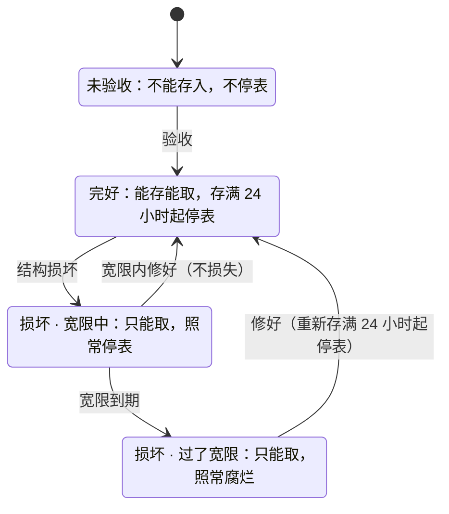

# 腐烂系统与粮仓设计规格

> **状态：PENDING（待拍板）。** 设计已经过三轮多代理审查，尚未实现；「待拍板清单」里的 14 项定下后再开工。腐烂是物品回收、不是信用点回收，但按 [文档索引](README.md) 的规矩，实现前仍要在 [经济收支总表](Economy_BalanceSheet_DesignSpec.md) 登记这条物品 sink。
> 最后核对：2026-10-10 · 核对基线：origin/main 506eed14 · 归属模块：wok-freshness（新建，腐烂底座）、wok-job-farmer（粮仓，`job/farmer/granary`）
> 审阅过程中的讨论与批注在服主的 Claude Doc 审阅稿里；本文件是同一内容的仓库存档，以后以本文件为准回写。

所有食物和原料都按小时计保质期（生鲜 12 小时，其余多为 36–48 小时），到期变成只能堆肥的“腐烂物”；只有玩家自己盖的粮仓能让食物停表：连续存满 24 小时才开始停表，每件最多停 21 天。人人第一个周末就能盖出最低档粮仓，下线前一键存入，下周末回来仓里的东西只少 1 小时；高档粮仓由对应等级的农夫上门验收。下面先给规则一页纸和 14 项待拍板，再展开细节。

模块落位、mixin 清单、存档、时钟、开服迁移、性能和测试等实现细节见文末「附录：实现要点」。

## 规则一页纸

玩家拿到食物就开始按小时计时，到期变成腐烂物；放进粮仓、连续存满 24 小时后开始停表。

- **拿到手就计时。** 物品格子顶部有一条保鲜条，快烂时左上角直接显示剩几小时；鼠标悬停能看到“剩 1 天 5 小时 · 周日 20:00 腐烂”。
- **离线期间照样计时。** 服务器一直开着；停服满 1 小时按整小时补回。
- **到期换成“腐烂物”。** 下一次被“看到”时换：进背包、打开箱子、拿去加工、被漏斗搬运。腐烂物不能吃、不能卖、不能酿酒、不能交任务，只能堆肥。
- **做成别的东西不会重新计时。** 产物跟着原料里最老的那件走；用火做熟的额外多给 1/4 保质期，所以生肉 3 小时内做熟能回满 48 小时。
- **同种食物会自动叠在一起，** 新鲜度按件数取平均；新鲜度相差太多、或者从粮仓取出来的不会叠。
- **粮仓是自己用任意方块盖的小屋，能存多少看里面有几个储粮囤，每人能放几个储粮囤看自己的农夫等级。** 连续存满 24 小时后开始停表，每件最多停 21 天；不烧燃料，不管你在不在线。存一夜第二天就取不算停表，所以它是“出门用的仓库”，不是每天下线的暂停键。
- **下线前点一次“一键存入”**（默认连快捷栏一起存），这是上学玩家唯一要记住的事。
- **闪耀厨师菜只在出锅后 48 小时内算闪耀，** 过了按超凡结算。效果和数值不变，只是时长变短。

| 规则 | 数值 |
| --- | --- |
| 计时 | 按整点小时分批（物品内部记到分钟）；停服满 1 小时按整小时补 |
| 保质期 | 生鲜 12 小时 / 果蔬 36 小时 / 熟食 48 小时 / 根茎 48 小时 / 谷物 48 小时 / 腌制 7 天 |
| 腐烂终态 | 换成“腐烂物”，1 换 1，碗和瓶子退回 |
| 加工 | 产物按原料里最差的剩余比例算；加热工序再加 25%；最少给 1 小时 |
| 同种合并 | 剩余相差不超过 1/8 保质期（至少 2 小时）、停表额度相同才叠，剩余取件数加权平均 |
| 粮仓停表 | 连续存满 24 小时才停表（不满 24 小时取出本次不算）；每件累计最多停 21 天 |
| 粮仓等级门 | 档位（粮棚/冷库/官仓）在验收那一下读验收人的农夫等级：L1/L5/L7；档位只管能存什么和功能 |
| 储粮囤额度 | 看本人农夫等级：L1 3 个，每级 +1，L10 13 个（全服合计，每个 27 格）；允许多人合建；每人最多 2 座账台 |
| 跳蚤市场 | 剩余不足 6 小时不能上架；托管期间照常腐烂 |
| 村民卖出的食物 | 到手时剩 6 小时 |
| 闪耀窗口 | 出锅后 48 小时（等于熟食保质期） |

## 待拍板清单（14 项）

这 14 项会改变玩法或工期，拍板后把“状态”列改成 DECIDED，并回写正文。其余次要事项已按推荐定下：腐烂物做终态、临期降营养放三期、奖杯鱼豁免、BnC 和 DrinkBeer 的酒归腌制、鸡蛋归果蔬、作物箱只能单向压缩、抽屉拒收易腐品、精妙背包不上服、一键存入默认带快捷栏、模块落位、先做完 P0 前置修复；粮仓方面：替别人验收不限次数、自己退出或打包的待领粮单不停表、OP 降级后最晚放的超额储粮囤停用、建筑技术上限 4,096 格。

| # | 问题 | 推荐 | 备选 | 状态 |
| --- | --- | --- | --- | --- |
| 1 | 计时口径 | 按整点小时分批（物品内部记到分钟，同一小时拿到的照常叠）；停服满 1 小时补整小时；挂钟异常跳变自动按停服补偿处理，不冻结 | 按天分批（最短只能设 2 天）；按 4 小时分批（碎片更少，但到期时刻最多差 4 小时） | PENDING |
| 2 | 保质期 | 生鲜 12 小时 / 果蔬（含鸡蛋）36 小时 / 熟食、根茎、谷物 48 小时 / 腌制 7 天 | 果蔬 24 小时（第二天同一时刻、在线时烂）；腌制也压到 2 天以内（放在外面的东西一周后全烂，只剩粮仓）；生鲜 6 小时（一次 6 小时的在线就会烂） | PENDING |
| 3 | 粮仓停表 | 连续存满 24 小时才停表（不满 24 小时取出本次不算）；每件累计最多停 21 天 | 存入 1 小时后就停表（天天上线的人能把粮仓当暂停键，熟食约 12 天才烂）；上限 14 天（考试周会烂掉更早一周存的货，错过两个周末全烂） | PENDING |
| 4 | 粮仓收什么 | 粮棚起收除生鲜外的全部，包括家常熟食；冷库起加收生鲜；带厨师品质的菜一律不收 | 厨师菜照收、只给 7 天额度；熟食到冷库才收 | PENDING |
| 5 | 粮仓形态、储粮囤额度和档位 | 自由封闭房间，大小随玩家；容量 = 启用的储粮囤 × 27 格；每人能放的储粮囤看本人农夫等级（L1 3 个，每级 +1，L10 13 个，全服合计）；允许多人合建；档位并成粮棚/冷库/官仓（L1/L5/L7 验收），只管能存什么和功能；每人最多 2 座账台 | L1 2 个或 4 个储粮囤；每个储粮囤 9 格或 36 格；保留五档；官仓门槛改 L9；固定蓝图（省约 2.5 人日，但所有人的粮仓长一样） | PENDING |
| 6 | 结构损坏后的宽限 | 取“损坏后 7 天”和“主人损坏后首次上线起 3 天”中较晚的，最长 28 天；宽限期内修好不损失 | 固定 7 天（考试周可能扛不住）；损坏立即失效 | PENDING |
| 7 | 合建与共享 | 储粮囤各归各，房主也拿不走；囤主可给每个囤开放名单（最多 16 人，可存可取/只存）；官仓可设公开捐粮、公开取用（一期做，来不及先砍）；租行取消，带自己的囤入册即可 | 公共池模式（所有囤合成一池再加权限，概念多、多 8–12 人日）；官仓公开模式推到二期 | PENDING |
| 8 | 加工继承的范围 | 一期接合成、配方书、熔炉三件套、营火，FD 砧板/煎锅/炉灶/厨锅，BnC 发酵桶（加成 0）和 refurbished 煎锅/烤箱/微波炉；加热 +25% | BnC 和 refurbished 等二期（发酵桶能把剩 1 小时的生肉做成满 7 天的肉干）；不给加热加成（下线前没法抢救快坏的肉） | PENDING |
| 9 | 闪耀菜 | 方案 B：出锅后 48 小时（正好等于熟食保质期），停服满 1 小时就补窗口；方案 A 做成开关，默认关 | A 和 B 同时开；只开 A（挡得住立刻重挂，但不防囤）；窗口取 24 小时 | PENDING |
| 10 | 开服迁移 | 开服即上，和粮仓同一批；测试期存货开服时剩 6 小时、不能进仓，也永远不和新货叠在一起 | 给测试期存货完整保质期（开服头两天集中出货）；一律视为已烂 | PENDING |
| 11 | 村民卖出的食物 | 到手剩 6 小时 | 不拦（作物换绿宝石、再换新鲜面包，等于不会腐烂的食物银行）；删掉村民的食物报价 | PENDING |
| 12 | 经济预期 | 接受“腐烂托不住生作物价，只托熟食、厨师菜、生鲜”；上线后盯三条线；产能问题另开议题 | 要求本系统同时压产能（例如高等级减产），不建议 | PENDING |
| 13 | 开服版本的范围 | 按完整 P1（61–72 人日）排期；开服日期压到 13 周以内时按「分期上线」里的顺序砍 | 一开始就按裁剪版（约 56–67 人日）做 | PENDING |
| 14 | 同种食物合并 | 拾取、点击叠放、Shift 快移、一键存入时，剩余相差不超过 1/8 保质期（至少 2 小时）且停表额度相同才叠，剩余取件数加权平均；机器出品合并取最老；漏斗、拖拽、掉落物不合并 | 不合并（同种食物按小时拆成很多小堆）；一律取最老（新货一叠进老堆就被拉低）；无条件取平均（快烂的货能被新货“救活”，测试期旧货会被冲淡） | PENDING |

## 保质期与豁免

六类保质期从 12 小时到 7 天；放在外面的东西撑过一个周末，撑不过一周，跨周只能靠粮仓。

下表按“周六 15:00 拿到”算；“下线前进仓”指周日 19:30 一键存入、下周六 14:00 回来。

| 类别 | 保质期 | 代表物品 | 最低能进哪档粮仓 | 周六 15:00 拿到，什么时候烂 | 一周不进仓 | 下线前进仓，下周六回来 | 定数理由 |
| --- | --- | --- | --- | --- | --- | --- | --- |
| 生鲜 | 12 小时 | 生牛肉、生猪肉、生鸡肉、生羊肉、生兔肉、生鱼（含 Tide）、FD 的肉馅、培根、鱼片、火腿，蟹、虾、贝 | 冷库 | 周日 03:00 | 烂 | 存进冷库剩余原样保留 | 一次在线最长约 6 小时，有 2 倍余量；必须当场做熟或进冷库 |
| 果蔬/蛋/面团 | 36 小时 | 卷心菜、番茄、苹果、各种浆果、西瓜片、葡萄、樱桃、黄瓜、茄子、韭菜、鸡蛋、面团、生面条 | 粮棚 | 周一 03:00 | 烂 | 剩余原样保留（只多扣 1 小时） | 整个周末不用中途存仓；24 小时会在第二天同一时刻、在线时烂 |
| 熟食与菜品 | 48 小时 | 熟肉熟鱼、面包、烤马铃薯、汤羹、FD 及各附属的菜、派/蛋糕/盛宴的物品形态、果汁、矿石鱼汤、家常菜、厨师菜 | 粮棚（厨师品质菜不收） | 周一 15:00 | 烂 | 剩余原样保留 | 周六做的周一才烂；所有能吃、没标类别的东西默认归这一类 |
| 根茎/瓜 | 48 小时 | 马铃薯、胡萝卜、甜菜根、洋葱、大蒜、南瓜、整块西瓜 | 粮棚 | 周一 15:00 | 烂 | 剩余原样保留 | 按用户要求的“1–2 天”取上限 |
| 谷物/干货 | 48 小时 | 小麦、农夫小麦、FD 稻米、稻穗、面粉 | 粮棚 | 周一 15:00 | 烂 | 剩余原样保留 | 天天上线的农夫当天卖；上学玩家放进粮仓等到能卖 |
| 腌制/风干 | 7 天 | 肉干、泡菜、腌黄瓜、果酱、奶酪块和整块奶酪轮、BnC 发酵饮品、DrinkBeer 啤酒 | 粮棚 | 下周六 15:00 | 下周六 14:00 上线时还剩约 1 小时 | 剩余原样保留 | 唯一能在外面放一周的类别，奖励“加工保存”；超出“1–2 天”，需要服主确认 |
| 闪耀窗口 | 出锅起 48 小时 | 闪耀品质的厨师菜 | 不能进粮仓 | 周一 15:00 起按超凡结算 | — | — | 覆盖一个周末：周六做的，周日还能当死亡保险 |

**怎么算：** 剩余小时 = 批次时刻 + 已停表小时 + 保质期 − 现在，剩余 ≤ 0 就算腐烂。批次时刻取拿到时的整点，物品内部记到分钟（合并时才会出现非整点）。保质期只写在配置里，不写进物品，改了配置全服存量立刻按新值算。

### 豁免清单（不腐烂、不盖章、粮仓不收）

| 物品 | 理由 |
| --- | --- |
| 各种种子（含 farmer\_seed） | 生产资料 |
| 可可豆、地狱疣、糖、甘蔗、蜂蜜瓶、蜜脾、蜂蜜块、干海带、干海带块 | 本来就耐放；能互相转换的整组豁免，省得一条条去堵 |
| 牛奶桶、FD 牛奶瓶 | 桶和瓶能互换，整组豁免 |
| 本 MOD 的酒、Vinery 的酒 | 有自己的陈酿体系，越放越值钱 |
| 干小麦 | 酒窖燃料 |
| 金苹果、附魔金苹果、金胡萝卜、闪烁西瓜片 | 金制食物 |
| 腐肉、蜘蛛眼、发酵蛛眼、毒马铃薯 | 本来就是烂的；腐肉是日常任务的上交物 |
| 紫颂果、爆裂紫颂果 | 不按普通食物处理 |
| 矿石鱼 | 不能吃，按固定价收购，属于矿物经济 |
| 奖杯鱼 | 1% 出率的收藏品，每条都独一无二 |
| 腐烂物本身 | 终态 |

判定顺序：

1. 先看物品自带的数据：本 MOD 的酒、Vinery 带年份的酒、奖杯鱼，直接豁免。酒和鱼由各自模块登记豁免规则。
2. 再看豁免标签。
3. 再看六个类别标签。
4. 没标类别、但能吃的，一律归熟食（48 小时）。
5. 其余不腐烂。

所以小麦、农夫小麦、稻米、盛宴/派/蛋糕的方块物品、南瓜、整块西瓜、奶酪轮这些“不能直接吃”的东西，必须写进类别标签。开服时的自检会逐条核对。

### 玩家看到的显示

| 情况 | tooltip 第一行 | 第二行 |
| --- | --- | --- |
| 还没盖章 | 保质期 48 小时（到手开始计时） | 类别 · 能进哪档粮仓 |
| 剩 ≥ 24 小时（绿） | 新鲜 · 剩 1 天 5 小时 · 周日 20:00 腐烂 | 谷物 · 任意粮仓可存 |
| 剩 6–24 小时（黄） | 尚可 · 剩 9 小时 · 今天 23:00 腐烂 | 生鲜 · 需存进冷库 |
| 剩 < 6 小时（红） | 临期 · 剩 3 小时 · 17:00 腐烂 | 生鲜：3 小时内做熟能回满 48 小时 |
| 最后 1 小时（红） | 不到 1 小时就腐烂 | — |
| 已过期、还没换成腐烂物 | 灰字：已腐烂 · 取出后变成腐烂物 | — |
| 在粮仓里、存入不满 24 小时 | 刚存入 · 再存 X 小时开始停表 | — |
| 在粮仓里、停表中 | 停表中 · 取出后剩 1 天 5 小时 · 停表额度剩 12 天 | — |
| 停过表的东西在外面 | 照常显示剩余时间 | 已停表 5 天 3 小时 / 21 天 |
| 带厨师品质的菜 | 照常显示剩余时间 | 厨师菜 · 不能进粮仓 · 闪耀剩 43 小时 |
| 奖杯鱼 | 奖杯标本 · 不会腐烂 | — |

- 按住 Shift 多显示一行：“同种食物会自动叠在一起，新鲜度取平均；新鲜度相差超过 X 小时、或者从粮仓取出的不会叠。”
- 颜色按剩余的绝对小时数分：绿 ≥ 24 小时、黄 6–24 小时、红 < 6 小时。生鲜（12 小时）永远不会是绿色，提醒玩家“撑不过今晚”。
- 坏数据一律降级显示，不报错。

### 物品栏里的保鲜条

不用鼠标悬停：每个会腐烂的物品格子上都直接画出还能放多久，快捷栏、背包、箱子、粮仓和本 MOD 的各种界面都一样。

示意（格子顶部是保鲜条，左上角数字默认只在不到 24 小时时显示）：

| 格子 | 保鲜条 | 左上角数字 | 说明 |
| --- | --- | --- | --- |
| 牛排 ×12 | 绿，约 83% | — | 剩 40 小时 |
| 生牛肉 ×6 | 红，约 42% | 5h | 剩 5 小时 |
| 面包 ×32 | 黄，约 42% | 20h | 剩 20 小时 |
| 卷心菜 ×9 | 绿，约 83% | — | 剩 30 小时 |
| 腌黄瓜 ×4 | 绿，约 86% | — | 剩 6 天 |
| 钻石剑 | 无 | — | 不会腐烂 |
| 苹果 ×3 | 红，约 4% | <1h | 不到 1 小时 |
| 粮仓里的小麦 ×64 | 蓝 + 暂停标记 | — | 停表中，条不再变短 |
| 粮仓里的马铃薯 ×20 | 绿 | — | 刚存入，再存 9 小时起停表 |
| 粮仓里的胡萝卜 ×7 | 格子变灰、条清空 | — | 已腐烂，打开时换成腐烂物 |

- **保鲜条：** 格子顶部一条细条，长度 = 剩余 ÷ 保质期，颜色和 tooltip 一致（绿 ≥ 24 小时、黄 6–24 小时、红 < 6 小时）。放在顶部，不和底部的耐久条、右下角的数量打架。不会腐烂的东西没有条。
- **剩余数字：** 左上角小字，不到 1 天显示小时（“5h”），1 天以上显示天（“2d”），不到 1 小时显示“<1h”。默认只在不到 24 小时时显示，免得满屏数字；客户端设置可以改成始终显示或不显示。格子太小写不下中文，所以用 h/d。
- **粮仓里：** 停表中的格子条变蓝、带暂停标记，条长不再变；刚存入、还不满 24 小时的照常显示。
- **已过期、还没换成腐烂物的：** 格子变灰、条清空。
- **快捷栏提醒：** 背包里有东西 1 小时内要烂时，快捷栏上方提示一次“背包里 3 件食物 1 小时内腐烂”，每小时最多一次。
- **平板（WebUI）：** 市场挂单和物品详情显示“剩 X 小时”。
- **不显示的地方：** JEI 配方、创造物品栏里还没盖章的物品。
- **做法：** 客户端用 Forge 的物品格子装饰接口（已核实 47.3.0 有 IItemDecorator），所有界面通用；用同步下来的时钟和保质期配置现算，只是显示，一切以服务器为准。约 1–1.5 人日。

## 腐烂终态

到期的食物在原格子里 1 换 1 变成新物品“腐烂物”（freshness\_rot），只能堆肥。

- **物品：** 64 个一组，不能吃，没有市场锚价。
- **怎么换：** 碗装、瓶装的食物把碗和瓶退回；放不下就给玩家，玩家也放不下就掉在原地。
- **去向：** 堆肥桶每件 30% 概率加一层；有 FD 时多一条有机堆肥配方：泥土 + 腐烂物 ×2 + 稻草 ×2 + 骨粉 ×4（仿照 FD 的腐肉配方）。
- **为什么不刷：** 原版堆肥桶大约要 21 个腐烂物才出 1 份骨粉，新鲜作物约 10 个就出 1 份；有机堆肥本身要净消耗骨粉。故意放烂永远不划算。
- **为什么不直接变腐肉：** 日常任务 daily.turnin.rotten 收腐肉 ×64，变成腐肉等于白送这个任务。
- **为什么不只打标记：** 卖麦、酿酒、交任务、配方、村民交易都只认物品种类、不看数据。换成独立物品，这些地方自动拒收。
- **快烂了要不要降营养：** 一期不降，只在 tooltip 里提示。三期看数据，再决定要不要做“临期营养 ×0.6”。

## 加工与压缩

做成别的东西不会重新计时：产物跟着原料里最老的那件走，压缩方块只能压不能拆，所有“切开再拼回”的循环转一圈都不会变新。

### 继承规则

- 对每件会腐烂的原料，算它的剩余比例 = 剩余小时 ÷ 保质期。豁免原料不参与；还没盖章的原料按 1 算。
- 产物剩余比例 = 原料里最低的比例 + 加成，最高为 1。
  - 加成 0.25：熔炉、烟熏炉、高炉、营火、FD 煎锅/炉灶/厨锅、refurbished 煎锅/烤箱/微波炉、本 MOD 的炸锅和烤炉。
  - 加成 0：合成、砧板切配、备餐台、压缩、BnC 发酵桶。
- 产物剩余小时 = 产物保质期 × 剩余比例，向下取整，最少 1 小时。
- **任何一件原料已经过期，就不出产物。** 机器会把过期原料换成腐烂物；合成格直接不出结果。
- **停表额度跟着走：** 产物的“已停表时间”取原料里最大的那个，所以没法“冻满额度 → 做熟 → 再冻满”。
- **机器出品合并取最老：** 熔炉、厨锅输出格里新旧产物合成一堆时，剩余取较少的那批，停表时间取较大的那批。
- **为什么取最差不取平均：** 防止拿新货稀释老货（群峦 TerraFirmaCraft 也这么做）。加热加成有上限，一条工序链最多 2–3 步，收益封得住。

例子：

- 剩 24 小时的小麦（48 小时制，比例 0.5）合成面包：面包剩 48 × 0.5 = 24 小时。
- 剩 3 小时的生牛肉（比例 0.25）烤成牛排：比例变成 0.5，牛排剩 24 小时。
- 剩 9 小时的生牛肉（比例 0.75）烤成牛排：比例 1.0，牛排剩满 48 小时。也就是说，生肉 3 小时内做熟不亏。
- 剩 1 小时的生肉放进 BnC 发酵桶做肉干：比例 1/12，肉干只剩 168 × 1/12 = 14 小时。

### 同种食物合并

按小时分批会把同种食物拆成很多小堆，所以玩家自己叠放时会合并、新鲜度取平均；但只在两堆足够接近时才合并，免得新货把快烂的货“救活”。

- **哪些时候合并：** 拾取进背包、背包里点击叠放、Shift 快移进已有的同种堆、粮仓“一键存入”。只对玩家背包和白名单容器生效。
- **合并条件（三条都要满足）：**
  1. 除新鲜度外其它数据完全相同（厨师品质、村民货标记、迁移标记都照常比较）。
  2. 两堆剩余相差不超过 1/8 保质期，至少 2 小时：生鲜 2 小时、果蔬 5 小时、48 小时类 6 小时、腌制 21 小时。同一次在线收的东西照样能叠。
  3. 停表时间相同。从粮仓取出的货和新货不自动叠，免得新货被悄悄扣掉停表额度。
- **怎么算：** 先对两堆各做一次检查（没盖章的先盖章，已经过期的先换成腐烂物、本次不合并）；剩余 = 按件数加权平均（精确到分钟）；停表时间不变；最后按“现在 + 剩余 − 保质期 − 停表时间”反算批次时刻写回物品。所有入口共用这一个函数。
- **为什么不会凭空多出新鲜度：** 加权平均保持“件数 × 剩余小时”的总和不变（《饥荒》也这么做）；窗口又把“先合并再加热白拿封顶部分”和“一直往老堆里并新货、老货永远不烂”都压到每件不超过半个窗口。
- **不合并的地方：** 漏斗、拖拽分发、双击收集、掉落物互相合并、机器和第三方容器接口、创造模式，都保持原版“完全相同才叠”。

### 一期接入的加工点

| 加工点 | 一期？ | 说明 |
| --- | --- | --- |
| 工作台、背包 2×2 合成格（含 Shift 批量合成、配方书合成） | 是 | 结果放进结果格之前就盖好继承章；原料有过期的，结果格为空 |
| 配方书找料 | 是（必须） | 不修的话，任何带章的原料都会“显示能合成、点了放不进去” |
| 熔炉、烟熏炉、高炉、营火 | 是 | 继承、加热加成、输出合并取最老、原料过期就停工 |
| 漏斗 | 是 | 每次搬运时给没章的易腐品盖章、把过期的换成腐烂物；不做任何合并 |
| FD 砧板 | 是 | 切出来的东西继承板上那件原料（加成 0） |
| FD 煎锅（放在地上的和拿在手上的）、炉灶 | 是 | 不加热时放在里面的东西照常腐烂；做熟时继承原料 + 0.25；原料过期就变腐烂物、不出品 |
| FD 厨锅 | 是 | 继承 + 0.25；原料过期就停工；输出合并改成“同物品，并且除新鲜度外的数据也相同” |
| **BnC 发酵桶** | 是 | 继承，加成 0；否则剩 1 小时的生肉能直接变成满 7 天的肉干 |
| **refurbished 煎锅、烤箱、微波炉** | 是 | 继承 + 0.25；否则浆果能直接变成满 7 天的果酱 |
| 本 MOD 的炸锅、烤炉、备餐台 | 随厨师重构 | 出品统一调用继承接口 |
| 厨师“多福”多出的那份 | 随厨师重构 | 复制主产物的新鲜度 |
| 其它第三方加工点（三明治台、Create 鼓风机/石磨等） | 否 | 产物第一次被看到时按“剩一半保质期、停表额度记满”盖章，堵住额度清零和成倍放大；二期看数据再定要不要接继承 |

### 压缩方块与可逆转换

**规则 1：作物箱一类只能压缩，不能拆回。**

- 开服时和每次 /reload 后，代码自动扫一遍配方：“合成配方、只有一种原料、产出 ≥ 4 个、产物会腐烂、原料不会腐烂”的一律删掉。客户端和 JEI 同步看到；可配白名单；删了哪些写进日志。
- 覆盖约 50 种：FD 的作物箱、稻米袋、稻米捆，culturaldelights、Dumplings、crabbersdelight 的食物类，Vinery 的袋子，Delightful 的储存块，以及原版干草块拆小麦。
- 压成块的作物块从此只能当装饰或材料，tooltip 写明“不可拆回”。

**规则 2：“切开再拼回”的循环要么接继承，要么删掉切分那一步。**

- 对两套整合包的配方扫描发现约 14 组能无损往返：FD 的西瓜（9 片/合回）、南瓜、卷心菜、蛋糕、苹果派、巧克力派、甜浆果芝士蛋糕；BnC 的披萨、乳蛋饼、两种奶酪轮；casualness、Delightful 的若干派。
- FD 砧板一期接了继承，这些循环转一圈不会变新。
- 代码再自动找“非合成的切分配方 + 合成拼回”成对的情况：切分那一步没接继承的（例如 refurbished 砧板切西瓜），删掉切分配方并写日志。
- 能互相转换的两头必须同类别：奶酪轮和奶酪块都归腌制。

**规则 3：其余可逆转换。** 牛奶桶↔牛奶瓶、蜂蜜瓶↔蜂蜜块、干海带↔干海带块整组豁免；把快烂的土豆种下去再收是正常种地，接受。

**Storage Drawers：** 按小时分批后，抽屉会把同种食物拆成很多格，所以抽屉直接拒收所有易腐品，只放不腐烂的东西。抽屉的配置不认标签，所以由代码在启动时把所有易腐品登记进抽屉黑名单；登记失败就提醒 OP 用 /freshness dump 导出清单手动填。作物箱、干草块仍单独拉黑；测试服验证后如果还能绕过，就把 \[Drawers.Compacting\] enabled 改为 false。

**开服前公告：** 测试期地图里的作物箱，开服后拆不回来了。

### 放在地上的食物（盛宴、派、蛋糕、南瓜、西瓜、奶酪轮）

1. **放下时记账。** 读手上那件物品的批次时刻和已停表时间（还没盖章就先盖），按坐标记在区块数据里。厨师重构的盛宴源菜、品质和闪耀窗口也共用这份记录。
2. **没有物品来源的放置**（例如末影人放下的南瓜）：按“已经放了一半保质期”记。
3. **取份、切片。** 玩家右键之前先查这一格的记录：已过期就取消交互、方块消失、掉 1 个腐烂物；没过期就在这一下交互期间挂一个“来源”，这一下里新冒出来的易腐品，不管进了背包还是掉在地上，一律按记录盖章。
4. **挖下、炸掉、被活塞推碎：** 掉出来的东西按记录继承，然后删掉记录。
5. **记录自己清理：** 每次读取都核对方块种类，对不上就删；方块变成空气时删；区块加载时顺带清一遍。BnC 奶酪轮“未熟成 → 熟成”算同一个方块。
6. **防止被搬走：** 这些方块加进 Create 的“不可移动”标签，装配体搬不走。
7. **原版蛋糕：** 是在方块上直接吃的，吃之前先判断过期没有。
8. **没有记录的：** 自然长出来的南瓜、西瓜，一收割就由掉落时盖章。

## 粮仓：建筑与分档

粮仓是一间用任意方块搭的封闭小屋，屋里放账台、储粮囤、气窗（存生鲜的还要冷源）；能存多少只看里面启用的储粮囤数量，每个人能放几个储粮囤由他自己的农夫等级决定。房子盖多大随意，几个人还能把各自的储粮囤放进同一座房子合建。

### 部件

| 部件 | 作用 | 配方（无序，数值可调） |
| --- | --- | --- |
| 粮仓账台 | 粮仓的“大脑”：判房子、验收、管成员、显示状态，还能一次翻看你在这座粮仓里的全部储粮囤；本身不装东西。可以放在屋里，也可以嵌在墙上（建议嵌在外墙，来验收的人在屋外就能右键到）。每人最多 2 座 | 箱子 ×1 + 书 ×1 + 原木 ×4 + 粮食 ×3 |
| 储粮囤 | 装东西的容器，27 格（和木桶一样）。谁放下的就归谁，只有他和他开放的人能用。每人能放几个由他的农夫等级决定。整个要在屋里 | 木桶 ×1 + 木板 ×4 + 粮食 ×4 |
| 气窗 | 嵌在外墙上：一面贴着屋里，至少一面不贴屋里。外面被别人堵住也照样算数。每 4 个储粮囤要 1 扇 | 木栅栏 ×1 + 木活板门 ×2，出 2 个 |
| 冷源（冷库起） | 贴着屋里就行，可以是墙、地板或天花板。每 2 个储粮囤要 1 个 | 浮冰、蓝冰、refurbished 的冰箱/冷柜/冷藏箱 |

- “粮食”指小麦、农夫小麦、稻米。新手不练农夫也凑得齐，顺带给农夫小麦多一个用处。
- refurbished 的冰箱本身不保鲜，但可以当冷库的冷源，tooltip 写明这一点，接上玩家“冰箱是冷的”这个直觉。

粮棚示例（L1 一个人）：室内 36 格、3 个储粮囤（共 81 格）、1 扇气窗、1 个账台，约 40 分钟盖好。

```text
俯视（中间一层）              剖面（从南往北看）
墙墙墙墙墙墙                  墙墙墙墙墙墙  ← 屋顶
墙囤空空囤墙                  墙空空空空墙
墙空空空空窗                  墙空空空空窗
墙囤空空空墙                  墙囤空空囤墙
墙墙账门墙墙  ← 南墙          墙墙墙墙墙墙  ← 地板

墙 = 墙、屋顶、地板（任意方块）  空 = 屋内空气（要封闭）  囤 = 储粮囤（27 格，归放它的人）
窗 = 气窗（一面朝里一面朝外）    账 = 账台（可以嵌在墙上）  门 = 门、栅栏门（开关都算墙）
```

室内 36 格，最多撑 4 个储粮囤（每个 9 格）。要升到冷库（能存生肉生鱼）：室内至少 36 格、每个储粮囤 9 格，每 2 个储粮囤贴着屋里配 1 块冷源（至少 2 块，浮冰、蓝冰或冰箱），然后请 L5 以上的农夫来右键账台验收，粮仓仍归原主，库存原样保留。

墙、屋顶和地板用什么方块都行，外观由玩家自己设计；系统只看三件事：房间封闭、室内格数够、部件数量够。

### 房间判定

1. **从哪里开始判：** 从账台周围所有能走的格子各试一次，找出账台所在的封闭屋子。账台两边都是屋子的，提示“请换个位置”。
2. **哪些算墙：** 门、活板门、栅栏门不管开着还是关着都算墙；气窗也算墙。
3. **哪些算漏洞：** 树叶、脚手架、蜘蛛网、细雪。
4. **屋里不能有水或岩浆。**
5. **大小：** 由玩家自己决定，只要室内格数够本档的基础要求、并且每个储粮囤有 9 格空间。为了防卡服只保留技术上限：室内最多 4,096 格、整间屋在以账台为中心水平 ±24、垂直 ±12 的范围内、一座粮仓最多启用 128 个储粮囤和 32 名成员。超出时提示“房子太大，请隔成两间，各放一座账台”。
6. **储粮囤：** 四周所有能走的格子都在屋里才算数。嵌在墙里、或有一面朝外的不算。
7. **一间屋只能有一座账台：** 冲突时只判后建的那座有问题。
8. **检查清单直接写数字，** 例如“储粮囤 20 个（启用 18，待启用 2：还差 1 扇气窗）”。不算数的储粮囤和漏风的第一个格子用粒子标出来，并写明原因。粒子只给点击的人看。

### 储粮囤额度（看你自己的农夫等级）

每个人能放几个储粮囤，看他自己的农夫等级：L1 3 个，每升一级多 1 个，L10 毕业再多给 1 个，全服合计；每个储粮囤 27 格。

| 农夫等级 | 储粮囤上限（全服合计） | 最多格数 | 最多件数 | 满档每小时产量（株） | 自产装满要几小时 |
| --- | --- | --- | --- | --- | --- |
| L1 | 3 | 81 | 5,184 | 108 | 48 |
| L2 | 4 | 108 | 6,912 | 144 | 48 |
| L3 | 5 | 135 | 8,640 | 360 | 24 |
| L4 | 6 | 162 | 10,368 | 450 | 23 |
| L5 | 7 | 189 | 12,096 | 1,000 | 12 |
| L6 | 8 | 216 | 13,824 | 1,200 | 11.5 |
| L7 | 9 | 243 | 15,552 | 2,160 | 7.2 |
| L8 | 10 | 270 | 17,280 | 2,520 | 6.9 |
| L9 | 11 | 297 | 19,008 | 4,320 | 4.4 |
| L10 | 13 | 351 | 22,464 | 5,760 | 3.9 |

- **不练农夫的人也是 L1，** 所以人人都有 3 个储粮囤（81 格）。L1 一个周末的收成按小时分批后约 36–52 格，放进去还剩 29–45 格。
- **练农夫的奖励很直观：** 每升一级多放 1 个储粮囤（多 27 格），L10 比 L1 多存将近 4.5 倍。
- **但囤不住产量：** L9 的 297 格只够他自己 4.4 小时的产量，其余只能卖、吃、加工或者烂掉；进了粮仓的东西每件也最多停表 21 天。
- **管理员改一行配置就能整体调整**每级囤数和每囤格数。

### 容量怎么算

- **储粮囤本身就是容器：** 东西装在囤里，谁放下的囤，里面的东西就归谁（下面叫“囤主”）。账台不装东西。
- **额度：** 你在全服放下的囤数，加上待领粮单占用的囤数，不能超过你这一级的上限。放在哪里都算：自家、学院、朋友家、不成立的房间、野外。
- **启用：** 只有“启用”的囤才能存、才停表。启用要同时满足：在一座已验收、完好的粮仓里并且整个在屋里；囤主是这座粮仓的成员（房主本人或已入册的人）；房子的部件撑得住它；囤主没有超额；这座粮仓启用的囤还不到 128 个。没启用的囤只能取、不能存，里面的东西照常腐烂。
- **一座粮仓的总容量** = 所有成员启用的囤数 × 27 格；每个成员的份额 = 他自己在这里启用的囤数 × 27 格。

**部件按囤数配：**

| 要求 | 粮棚 | 冷库 | 官仓 |
| --- | --- | --- | --- |
| 室内格数 | 至少 18 格，且每个入册的囤 9 格 | 至少 36 格，且每个囤 9 格 | 至少 72 格，且每个囤 9 格 |
| 气窗 | 每 4 个囤 1 扇，至少 1 扇 | 同左 | 同左 |
| 冷源 | 不要 | 每 2 个囤 1 个，至少 2 个 | 同冷库 |

- **可支撑囤数** = 室内格数 ÷ 9、气窗数 × 4、冷源数 × 2 三者取最小（冷源只在冷库和官仓算）。
- **囤比可支撑的多：** 粮仓本身不坏，按入册先后排，最后入册的那几个不启用（新放进来的叫“待启用”；原来启用、因为部件被拆撑不住的叫“停用”，走宽限期）。只有基础要求不满足、漏风、进水或两座账台冲突，才判整座损坏。
- **加囤、减囤都不用重新验收。**

**例子：**

| 情形 | 档 | 囤数 | 室内至少 | 气窗 | 冷源 | 容量 |
| --- | --- | --- | --- | --- | --- | --- |
| 小雪一个人（L1） | 粮棚 | 3 | 27 格 | 1 | — | 81 格 |
| 三个室友（L1、L1、L2） | 粮棚 | 3+3+4=10 | 90 格 | 3 | — | 270 格（各 81 / 81 / 108） |
| L9 农夫自己用 | 冷库 | 11 | 99 格 | 3 | 6 | 297 格 |
| 学院合建（会长 L9，20 名学生各带 2 个） | 官仓 | 51 | 459 格 | 13 | 26 | 1,377 格 |

### 档位管什么

档位不再给容量，只管能存什么和有哪些功能，所以五档并成三档。

| 档位 | 谁能验收 | 能存什么 | 额外功能 |
| --- | --- | --- | --- |
| 粮棚 | L1（人人都是 L1，自己点就成立） | 除生鲜外的全部易腐品，包括家常熟食 | 私有囤、开放名单、多人合建 |
| 冷库 | L5 | 再加生鲜（生肉、生鱼、肉馅、海鲜等） | 同上 |
| 官仓 | L7 | 同冷库 | 再加：囤主可以把自己的囤设成“公开捐粮”“公开取用”；流水保留 300 条 |

- **所有档都不收：** 带厨师品质的菜、豁免品、已用完 21 天停表额度的东西、已经腐烂的东西。
- **请人上门验收的好处还在：** L1 学生把囤放进学姐验收过的冷库，照样能存生肉生鱼。
- **替别人验收不再限每周次数：** 档位已经不给容量，限次数没有防囤作用；系统继续记录“验收人 → 房主”供 /granary audit 查。

### 总上限

- **全服停表库存上限 = 所有人的储粮囤额度之和 × 1,728 件。** 合建只是把囤放到一起，不增加任何人的额度；待领粮单也占额度。唯一例外是 OP 降级后、超额囤还在宽限期的那几天。
- **例子：** 50 人的服（30 人 L1–L2、10 人 L3–L6、7 人 L7–L9、3 人 L10）合计约 279 个囤、约 48 万件，约等于全服 4.5 天的系统收购额度。极端情况 50 人全满级约 112 万件。
- **存货的年龄也封顶：** 每件最多停表 21 天，防“囤几个月一次砸盘”的目的不变。

## 粮仓：停表、验收、损坏与共享

### 停表规则

东西连续存满 24 小时才开始停表、每件最多停 21 天；每个储粮囤和里面的东西归放它的人，合建时各归各；档位在验收时锁定；结构坏了每位囤主都有至少 7 天宽限。

- **连续存满 24 小时才算停表。** 不满 24 小时就取出，这次停表记 0，东西和放在外面一样老去；存满 24 小时，按“存放小时 − 1”记停表。中途打开看一眼不会重新计算。
- **为什么是 24 小时：** 按小时计以后，如果存进去 1 小时就停表，天天上线的人下线存、上线取，每天只老 4 小时，48 小时的熟食要 12 天才烂，粮仓就成了暂停键。门槛设在 24 小时，存一夜就取拿不到停表；上学玩家一周不来，照样全程停表。
- **每件东西累计最多停 21 天（504 小时）。** 用完之后即使还在仓里也照常腐烂；新存入时直接拒收，提示“这批货已经停过 21 天”。
- **为什么是 21 天：** 按小时计以后，停表上限就是上学玩家存货的全部寿命。上限 14 天时，考试周会烂掉更早一周存的货，错过两个周末全烂；21 天两种都保得住。各类最长寿命：48 小时类约 23 天、果蔬约 22.5 天、生鲜约 21.5 天（只有冷库能存）、腌制 28 天，都短于按天计时的原稿。
- **例子：** 周日 19:30 存、下周六 14:00 取（存 138.5 小时），停表 137.5 小时；周六 18:00 存、周日 14:00 取（存 20 小时），停表 0。
- **防新货蹭老格子：** 已经有东西的格子，只接受“本小时存入的同一批”追加，其它新货只能进空格子。这条写进格子的放入判定，Shift 快移也绕不过；菜单开着时每到整点先结算。
- **“一键存入”：** 默认连快捷栏和副手里的易腐品一起存（可以打开“保留快捷栏”，按玩家记住）；同种食物按「同种食物合并」的规则先合成一堆，再放进空格；跳过厨师菜和额度已用完的东西。按钮提示写“下线前点一下”。

### 建造与验收

1. **放账台。** 谁放的账台，谁就是房主。每人最多 2 座账台（还没验收的也算），够“自家一座 + 学院或社团一座”。去别人房子里放储粮囤的成员，不需要自己的账台。第一次放下时自动打开“结构与验收”页。
2. **盖房子、放储粮囤。** 放囤时按放置者当时的农夫等级查额度，到上限就放不下去，提示写明“储粮囤已达上限 5 个（农夫 L3），升到 L4 可放 6 个”。照着结构页的清单补气窗、冷源。
3. **验收。** 任何人都能右键账台看到三档的清单。结构满足某一档、并且比当前档高时，“验收”按钮就能点。服务器在这一刻读点击者的农夫等级：粮棚 L1、冷库 L5、官仓 L7。验收的人不必是房主，房主不在线也能验收；不限次数，系统记下“谁替谁验收”。
4. **锁定后不追溯：** 验收人之后升级、降级，都不影响已锁定的档位。用仓时不看任何人的等级。
5. **加囤、减囤不用重新验收；升档** 要把房子改到下一档的要求再请人验收一次，库存原样保留。改造中暂时判成“损坏”也没关系，宽限期内照常停表。
6. **降档只有房主能做：** 还有成员的囤里有生鲜时，冷库不能降成粮棚；官仓降成冷库时，公开模式自动关闭并通知相关囤主。
7. **验收时把当时的部件公式拍下来：** 以后管理员改配置，只对新的验收生效。

### 损坏与宽限



宽限期 = 出事起 7 天与该囤主出事后首次上线起 3 天，取较晚的那个，最长 28 天。

房主和受影响的囤主上线都会收到损坏提醒；只要在宽限期内修好，停表天数和从没坏过一样。

- **宽限期（全系统统一一条，每位囤主各算各的）：** 取“出事那一刻起 7 天”和“该囤主出事后第一次上线起 3 天”两者中较晚的那个，最长 28 天。考试周第 2 天被人拆了墙，回来时东西照样完好。能这么放宽，是因为每件东西本来就最多只能停 21 天。
- **部件被拆、撑不住全部储粮囤时，** 只停用最后入册的那几个，同样走宽限期；基础要求不满足、漏风、进水、冲突才判整座损坏。
- **宽限期内修好什么都不损失；过了宽限才修好，** 修好后重新满 24 小时起恢复停表。
- **发现损坏要快：** 屋子范围内有方块被挖、被放、被炸、被活塞推动，尽快复查（同一座最快每 20 tick 一次，全服排队）；另外每 5 分钟错峰自查一次，打开时、验收前、区块加载时也各查一次。房子跨到未加载区块时不判，保持原状态。
- **结算顺序写死：** 先按原来的状态结算到现在，再切换状态。
- **通知：** 房主和受影响的囤主上线时都会收到提醒，内容包括坏在哪、宽限到什么时候。
- **粮仓不会散架，也不会掉东西。** 墙就是普通方块，靠 Flan 领地保护。结构页提示“建议建在自己的领地里，外圈留 1 格”。

### 合建：入册与权限

几个农夫可以把各自的储粮囤放进同一座房子，囤的总数超过任何一个人的上限也可以；每个囤和里面的东西仍归囤主，房主也拿不走。

- **怎么入册：** 房主在账台“成员”页按名字添加（对方离线也行）；或者别人先在房间里放下囤，房主收到“某某想加入（放了 2 个储粮囤）”的提示后点同意。没入册的囤不计入部件要求、不能存、不影响房子。建在 Flan 领地里时，房主要给成员“放置方块”的权限。
- **各归各：** 成员从账台打开时，只看得到、拿得到自己的囤，以及别人开放给他的囤。房主也看不到、拿不走别人囤里的东西，也拆不了别人的囤。成员页对所有成员公开“每人几个囤、启用几个”，不显示里面装了什么。
- **囤主可以开放自己的囤**（每个囤单独设，也可以一键套用）：
  - **私有：** 默认。
  - **名单：** 最多 16 人，每人选“可存可取”或“只存”，就是原来的托管人。用 /granary trust 设一份默认名单，新放的囤自动套用。
  - **官仓独有：** “公开捐粮”（任何走得进房子的人都能存，只收未腐烂的易腐食物，囤主设每人每天最多存几组，默认 2 组）和“公开取用”（每人每天最多取 N 组，N 由囤主在 0–9 里设，默认 1，北京时间 08:00 翻日）。
- **谁管什么：** 谁能走进房子由领地（Flan 的门和权限）管；进门之后能拿多少，由囤的设置管。

| 能做的事 | 房主 | 囤主（成员） | 名单里“可存可取”的人 | 名单里“只存”的人 | 官仓公开模式下的任何人 | OP |
| --- | --- | --- | --- | --- | --- | --- |
| 存取某个囤 | 只限自己的囤 | 自己的囤 | 被开放的那几个 | 只能存 | 捐粮只能存；取用每天限 N 组 | 能（记日志） |
| 设置囤的开放方式 | 只限自己的囤 | 自己的囤 | 否 | 否 | 否 | 能 |
| 验收、升档 | 够等级的人都能点 | 同左 | 同左 | 同左 | 同左 | 能 |
| 降档、入册、移出成员 | 能 | 只能退出自己 | 否 | 否 | 否 | 能 |
| 拆囤 | 自己的空囤；本房间里未入册的空囤；本房间里失联满 7 天的囤 | 自己的空囤 | 否 | 否 | 否 | 能 |
| 拆账台 | 没有其他成员的囤时 | 否 | 否 | 否 | 否 | 能 |

- **托管人和租行：** 托管人改成每个囤的开放名单；二期“租行”取消——想用高档粮仓的人带自己的囤入册就行，用的是自己的额度；想帮低等级朋友多存，可以把自己的囤开放给他（“借囤”）。
- **学院公共粮仓三种搭法（可以混用）：** ① 各放各的：学生把自己的囤带进学院冷库或官仓，入册后能存生鲜；② 公共粮柜：会长和干部把自己的几个囤设成“公开捐粮 + 公开取用每人每天 1 组”，或用名单只开放给社员；③ 团体名单（二期）：自管区模块合入 main 后，开放对象可以直接选“某学院自管区的全部住户”。

### 退出、拆走、移出

| 情况 | 谁来做 | 囤里的东西 | 停不停表 | 额度 |
| --- | --- | --- | --- | --- |
| 拆自己的囤 | 囤主 | 必须先取空，囤掉成物品 | — | 立刻归还 |
| 自己退出或打包（/granary leave、/granary pack，可以远程） | 囤主 | 连同囤一起进囤主的待领粮单 | 不停表（自己选的） | 待领粮单里每 27 格占 1 个囤，领完才归还 |
| 被房主移出 | 房主 | 连同囤一起进对方的待领粮单，对方上线收到通知 | 宽限期内停表 | 同上 |
| 未入册的空囤 | 房主随时可以拆 | —（囤进放置者的待领粮单） | — | 归还 |
| 失联满 7 天（不在完好的粮仓里，或一直没入册） | 在别人房间里的由房主拆，不在任何房间里的谁都能拆 | 连同囤一起进囤主的待领粮单 | 沿用原来的宽限期，不重新计算 | 同上 |
| 房子损坏、或部件被拆撑不住 | — | 留在原地，只能取不能存 | 每位囤主各走自己的宽限期 | 照占 |
| 房主想拆账台 | 房主 | 先把其他成员全部移出 | — | — |
| 账台被 OP 强拆或丢失 | — | 留在各自的囤里，只能取，囤变成失联囤 | 宽限期内停表 | 照占，直到囤主拆掉或打包 |
| OP 给囤主降级后超额 | — | 放得最晚的超额囤停用，只能取 | 宽限期内停表 | 拆到额度以内，或等级恢复后自动恢复 |
| 房主很久不上线 | — | 粮仓照常运作，不看房主在不在线 | — | OP 可以用 /granary admin transfer 把账台转给一名现任成员 |

- **待领粮单怎么领：** 用 /granary claim 分批领到背包，东西保留原来的新鲜度和停表记录；已经腐烂满 30 天的自动清掉并记日志。
- **堵循环的两条关键：** “待领粮单占额度”和“自己打包不停表”，见反漏洞表。

### 额度怎么记账

- **放置时检查：** 放下那一刻读放置者当时的农夫等级，“已放的囤 + 待领粮单占的囤”到了上限就放不下去。做法照搬耕地的放置上限，假玩家（机器）一律放不了。
- **按坐标记账：** 哪个坐标的囤归谁记在一张表里，和耕地归属表一样；囤被移除才归还额度，被取消的放置既不白送也不冻结额度。
- **放在不成立的房间里也占额度，** 放下时提示“这个储粮囤不在任何粮仓里：占用额度，不停表”。
- **归属不能转让：** 囤一旦放下就归放置者；拆下来是普通物品，谁再放下就归谁。
- **OP 降级：** 囤不拆；囤主下次上线、放囤或在线操作粮仓时按新等级重算，放得最晚的超额囤转为停用。管理员调低配置时也这样处理。正常游玩时等级只升不降。
- **小号：** 每个小号都是 L1，只多 3 个囤（81 格，约等于 L9 农夫 1.2 小时的产量）。服规写明一人一号；/granary audit 列出“成员 → 房主”“把囤开放成可取给别人”“验收人 → 房主”三种配对。

### 保护与防复制

- **账台和储粮囤都照捐赠箱的清单做全套保护：** 硬度 −1（Create 钻头和其它机器拆不动，主人和 OP 挖它的速度另算）；防爆；推不动；不能被生物破坏；加进 Create 的“不可破坏”“不可移动”标签；防 /clone 复制；创造模式中键不能带出库存；只有 OP 能带数据放置；假玩家（机器、Deployer）不能放置、打开或验收。
- **谁能拆：** 账台只有房主和 OP 能拆，而且要先把其他成员移出；空的、未验收或损坏的账台任何人都能拆，没人能拿它堵路。储粮囤只有囤主能拆自己的空囤；房主能拆本房间里未入册的空囤和失联满 7 天的囤。
- **有货的囤被移除（包括 OP 强拆）时，** 里面的东西从不掉在地上，只进囤主的待领粮单，拆的人拿不走。
- **不接漏斗、管道、Create：** 账台和储粮囤都不对外开放物品接口。
- **单格最多 64：** 不放大单格上限，避免数量超过 127 时存盘和同步被截断。
- **运营要做的事：** 把账台和储粮囤加进 Flan 的 interactBlockBlacklist，否则来验收的人、成员和名单里的人会被领地权限拦住；写进开服检查清单并在测试服实测。两者都不加进矿区维度的放置白名单。

### 界面、提示与命令

- **界面：** 账台页签为 我的囤（每页 2 个囤、54 格）/ 别人开放给我的 / 结构与验收 / 成员 / 流水；顶栏显示档位、状态、最早到期的一批和停表额度。储粮囤本身右键打开是 27 格界面加开放设置页。
- **玩家命令：** /granary 查看自己的账台和所有储粮囤的位置、状态、额度（“储粮囤 5/6”）；/granary claim 领取待领粮单；/granary trust 管理默认名单；/granary leave 退出某座粮仓；/granary pack 打包单个囤。OP 用 /granary audit、/granary admin transfer。
- **一次性提示（每人每条只出一次）：** 第一次有东西盖章、第一次变黄或变红、第一次变成腐烂物（附带“可以堆肥”）、第一次放账台、第一次被粮棚拒收生鲜、第一次存不满 24 小时就取出、第一次储粮囤达到上限（说明“升级农夫能多放”）。
- **登录汇报（通过 /login 后再发）：** 例如“离线期间：背包里 4 件食物已腐烂。你的 3 个储粮囤都在停表；最早到期的一批是马铃薯，取出后剩 1 天 2 小时。箱子、末影箱里的食物在打开时结算。”
- **在线时的提醒：** 这一小时里有东西变成腐烂物才提醒，并合成一条，不每小时刷屏。
- **对玩家的口径统一成三句话：** 食物有保质期，看格子上的保鲜条；下线前一键存入粮仓，存满 24 小时起停表，最多停 21 天；生肉生鱼 3 小时内做熟，或者放进冷库。

## 上学玩家走查

只要周日下线前点一次“一键存入”，普通周、考试周、甚至错过两个周末，回来时仓里的东西都只少 1 小时；不存的话，一周后除了腌制品全烂。

**人物：** 小雪，高二，每周六 14:00–18:00、周日 14:00–20:00 在线，农夫 L1，服务器常开。D 是第 1 周的周六，即 10/10。

### 普通周

**第 1 周周六（D）**

- 14:00 登录，做完日常任务，拿到马铃薯 ×18、小麦 ×20，都是 48 小时，周一 14:00 烂。弹出第 1 条一次性提示。
- 盖粮棚：用木头搭一间室内 36 格的小屋（最多撑 4 个储粮囤），做 3 个储粮囤、1 扇气窗、1 个账台，共用掉 15 株小麦；自己验收为粮棚，3 个储粮囤共 81 格，前后约 40 分钟。
- 下午种田：9 块低级耕地，每小时约 108 株农夫小麦。
- 15:00 打了 6 头牛：生牛肉显示“剩 12 小时 · 周日 03:00 腐烂”，第二行“3 小时内做熟能回满 48 小时”。17:00 用烟熏炉烤：剩 10 小时、比例 0.83，加 0.25 封顶为 1，牛排满 48 小时，周一 17:00 烂。
- 18:00 下线：不用存仓。周六拿到的东西最早周一凌晨才烂；就算存了，周日 14:00 取出也不满 24 小时，不算停表。

**第 1 周周日（D+1）**

- 周六收的果蔬（36 小时）周一 03:00 才烂，整个周末都能吃。
- 19:30 点“一键存入”（连快捷栏一起）：
  - 周六收的农夫小麦剩约 19–22 小时，周日收的剩约 42–48 小时，两批相差超过 6 小时，各占一格；
  - 马铃薯、剩下的牛排（剩约 21.5 小时）、面包等，共约 26/81 格。
- 周一到周五离线。粮仓所在区块整周不加载也没关系，剩余时间是读取时现算的。

**第 2 周周六（D+7）14:00**

- 存了 138.5 小时，停表 137.5 小时。登录汇报：“离线期间：背包里 0 件腐烂；粮仓「简易粮棚」完好，停表中；最早到期的一批是牛排，取出后剩 20 小时。”
- 仓里：周六那批麦剩约 18–21 小时，周日那批剩约 41–47 小时，牛排剩约 20.5 小时；停表额度用了约 5.7/21 天。
- 对照：同样的东西放在普通箱子里，除了腌制品全部烂掉。
- **不用的东西别取出来：** 一取出就开始计时，留在仓里就一直停表。她只取出牛排当天吃掉。
- 她还卖不了麦（L2 才能卖），粮仓正好替她攒着。第 2 周新收的麦再占几格，约 34/81 格。

**第 3 周周六（D+14）**

- 升到 L2（大约 2–3 个周末的经验，低置信）。
- 第 1 周的麦已停表约 305.5 小时，还在 504 小时的额度内，剩余和存入时一样。两周的约 1,300 株加当天新收的一起卖掉，在每天 2,160 株的上限之内。

**第 4 周（闪耀菜）**

- 周六 15:00 在市场买了 2 份闪耀菜，周六 10:00 出锅，闪耀窗口到周一 10:00。
- 当场吃一份，得到单命永久效果；周日 17:00 在矿洞里死了，吃第二份，仍在窗口内，效果恢复。
- 闪耀窗口和熟食保质期都是 48 小时，厨师菜又不能进粮仓，所以不存在“留到下周”：菜本身也烂了。

### 考试周（第 5 周周日下线，第 7 周周六回来，隔 306.5 小时）

- **下线前：** 把同桌小林加进自己储粮囤的“只存”名单；粮棚不收生肉生鱼，她全部烤熟；点“一键存入”。
- **回来时：** 考前存的货停表约 305.5 小时，剩余只少了入仓那 1 小时。更早存的批次累计停表超过 504 小时的会烂，没超过的照常保留。
- **留在背包和箱子里的：** 除腌制品外全部变成腐烂物，登录汇报写明件数，她丢进堆肥桶。
- **意外：被人拆了墙。** 离开后第 2 天有路人拆了粮棚一面墙（她建在领地外）。宽限期一直延到她回来后第 3 天，整段时间照常停表。她补好墙，什么也没损失。
- **错过两个周末（隔 474.5 小时）：** 考前存的货停表约 473.5 小时，仍在 504 的额度内，回来剩余照旧；还剩约 30 小时额度，正好用完回来的那个周末。

### 第 7 周以后：用上高档仓

- **第 5 周前后升到 L4（低置信），储粮囤额度变成 6 个：** 家里的小屋只撑得住 4 个，多出来的 2 个她带进学姐（L6）验收过的学院冷库，会长批准入册后，生鱼生肉也能存了。东西和额度都还是她自己的，合计仍是 6 个。
- **借囤：** 学姐也可以把自己的一个储粮囤对她开放“可存可取”，用的是学姐的额度。
- **她自己练农夫的好处很直观：** 每升一级多放 1 个储粮囤。

### 对照：天天上线的玩家

- **普通玩家（每天 20:00–23:00）：** 生肉当场做熟；果蔬 36 小时，后天上午才烂；熟食 48 小时，第三天上线时只剩约 1 小时，所以每两天要做一次饭或买一次菜。粮仓存一夜就取不算停表，只在要隔一天以上不来时才有用。
- **L9 农夫：** 每小时产约 4,320 株，一天约 3 万株；每天最多卖给系统 2,160 株，其余 48 小时内不卖、不吃、不酿就会烂；11 个储粮囤最多 19,008 件（只够他自己 4.4 小时的产量），存进去也最多多活 21 天。测试期囤的存货开服时只剩 6 小时。
- 他再也攒不出几个月的存货一次性砸盘。**但生作物的价格不会因此变高**（产能远大于需求，见「经济影响」）。真正变化的是：食物必须持续生产、持续购买，厨师菜和熟食的需求变成每天都有。

## 闪耀菜联动（随厨师重构同一批合入）

推荐开启方案 B：闪耀菜只在出锅后 48 小时内按单命永久结算，过了按超凡 30 分钟；方案 A 做成开关，默认关。

### 方案 B（推荐开启）

- 厨师盖闪耀章时，同时记下“闪耀到期时刻 = 出锅时刻 + 48 小时”。
- 吃的时候：是闪耀、并且还在窗口内，才按单命永久结算；否则按超凡 30 分钟结算。只缩短时长，效果和数值都不变，符合厨师重构的硬规则。
- **为什么是 48 小时：** 周六做的或买的，周日还能当死亡保险，正好覆盖上学玩家的一个周末；24 小时的话周日就失效；72 小时的话，天天上线的人能囤 3 天的量。
- **从出锅开始计时，** 不是从离开工作台开始，否则输出格就成了冰箱。
- **窗口是绝对时刻，** 任何容器都不能让它暂停。厨师菜本来就不能进粮仓。
- **停服补偿：** 停服满 1 小时，闪耀窗口就补上相应的小时数，免得几个小时的维护吃掉窗口。

### 方案 A（做成开关，默认关）

- 开启后，真正死亡后 10 分钟内吃闪耀菜只按超凡 30 分钟结算，tooltip 和屏幕下方会提示“死亡冷却中”，免得误吃。
- **为什么默认关：** 方案 B 已经把能囤的量压到两天以内；方案 A 会让在线时间宝贵的周末玩家每死一次就多受 10 分钟的罚。开服后如果“死了立刻重挂”成了问题，再打开。

### 实现要点

- **到期改名：** 窗口过期时，菜在下一次被看到时改成超凡并重新生成显示名。名字是盖章时写死的，不重建会出现“名字写着闪耀、实际按超凡算”。
- **开吃时拍快照：** 按有效品质拍下快照，吃完只认快照，避免吃到一半正好跨过窗口。
- **盛宴：** 闪耀窗口存在放置记录里，第一份按源菜的窗口算；第二份起本来就按超凡（已拍板）。
- **旧版闪耀菜（没有窗口字段）：** 只对旧版本的菜，并且只在厨师重构上线后 7 天内，第一次被看到时补一个 48 小时窗口；新版本的菜缺字段一律按已过期处理，不会出现“藏在没人看的地方、永远闪耀”的菜。
- **市场：** 挂单名称和详情一律按有效品质显示，并显示“闪耀剩 X 小时”。
- **腐烂：** 厨师菜本身照熟食 48 小时腐烂（正好等于闪耀窗口），烂了就是腐烂物，没有任何效果。

## 各持有点处理

除了粮仓，所有地方都照常腐烂；区别只在于什么时候盖章、什么时候把过期的换成腐烂物。

| 持有点 | 会不会烂 | 什么时候盖章或换成腐烂物 | 备注 |
| --- | --- | --- | --- |
| 背包、副手、盔甲、光标 | 照常 | 每 2 秒（错峰）；登录时；右键方块、和实体交互、打开任何容器之前 | keepInventory 开着也一样，背包唯一的出口就是烂掉 |
| 末影箱 | 照常 | 打开和关闭时 | 白名单容器 |
| 原版箱子、木桶、潜影盒、铁箱子、投掷器 | 照常 | 打开和关闭时；开服迁移 | 白名单容器 |
| 漏斗（含漏斗矿车卸货时经过的漏斗） | 照常 | 每次搬运 | 本模块 mixin |
| 嵌套容器（潜影盒物品、篮子、厨锅物品、Create 包裹） | 照常，章跟着物品走 | 取到背包时；开服迁移覆盖任意层 | — |
| Storage Drawers | 拒收所有易腐品 | 取到背包时；开服迁移 | 由代码登记进抽屉黑名单；作物箱一类另行拉黑 |
| Create 物品保险库、工具箱 | 照常 | 取出时；开服迁移 | 服规禁止自动机 |
| refurbished 冰箱、冷柜、冷藏箱 | 照常，就是普通箱子 | 打开和关闭时 | tooltip 写“冰箱本身不保鲜，可以当冷库的冷源” |
| 熔炉三件套、营火 | 照常 | 出品时继承；原料过期就停工 | 本模块 mixin |
| FD 砧板、煎锅、炉灶、厨锅 | 照常，放着不加热也照常烂 | 出品时继承；原料过期就换成腐烂物、不出品 | FD 兼容 mixin，一期 |
| 本 MOD 的炸锅、烤炉、备餐台 | 照常 | 出品时继承 | 随厨师重构 |
| 其它第三方厨具 | 照常 | 产物第一次被看到时按剩一半保质期、额度记满盖章（BnC 发酵桶和 refurbished 厨具已接继承） | 有上限的残留 |
| 酿酒台 | 照常 | 统计投料时跳过已腐烂的，先扣最老的 | 代码 |
| 酒窖 | 只装豁免物 | — | — |
| 跳蚤市场托管 | 照常 | 上架、浏览、购买时 | 剩余不足 6 小时不能上架；已腐烂的不显示、不能买 |
| 婚姻共享背包、离婚待领取物 | 照常 | 打开或领取时 | 白名单容器 |
| 邮件（refurbished、CNPC）、CNPC 银行 | 照常 | 收进背包时 | 不在开服迁移范围内，开服时公告 |
| 掉落物 | 照常 | 生成时；从存档读出时；拾取时 | 代码 |
| 展示框、盔甲架、运输矿车、驴、骡、羊驼 | 照常 | 取出时；从存档读出时迁移 | — |
| MTS 货箱 | 照常 | 取出时 | 不在迁移范围内，用 /freshness audit 巡查 |
| 放在地上的食物 | 按坐标记录计时 | 取份、拆下、炸毁时 | 见「加工与压缩」 |
| 田里成熟的作物 | 不计时，还是方块 | 收割时盖章 | 有上限的残留：要占地、要人手，耕地有上限 |
| 压缩方块 | 不烂，只能单向 | — | 见「加工与压缩」 |
| 捐赠箱（未合并的分支） | 拒收所有易腐品 | — | 现在只拒收可食用和带数据的物品，要改成拒收所有易腐品 |
| 村民 | 收什么新鲜度的都行；卖出的食物到手剩 6 小时 | 进背包时 | — |
| Curios 背部潜影盒槽 | 已由热修数据包关闭 | — | — |
| 精妙背包（只在测试端） | 照常 | 取出时 | 推荐不上正式服；要上就关掉喂食升级和压缩升级 |
| 粮仓 | 连续存满 24 小时起停表，每件最多 21 天 | 打开时先结算、再换腐烂物 | 自己结算，不在通用白名单里 |

**农夫乐事及附属的储物（已对照 jar 核实）：** FD 1.2.9 的橱柜和篮子都是原版箱子式容器（用原版箱子界面），按白名单容器处理，开服迁移也覆盖；篮子吸进来的掉落物生成时就已盖章。蟹农乐事的捕蟹笼渔获走战利品表（gameplay/crab\_trap\_loot），生成那一刻由全局掉落修改器盖章；它用自己的界面，把 CrabTrapMenu 加进白名单后，笼里烂掉的渔获打开就换成腐烂物，不加也会在取到背包时换。

## 反漏洞清单

49 条已知绕过办法里，46 条由代码或配置堵住（其中 4 条另加服规）；2 条是有上限、不能循环的残留；1 条（把食物交给小号当冰箱）按设计不做离线保护，因为离线也照常腐烂。按小时计后新增的 7 条、储粮囤额度与合建新增的 17 条列在表后。“代码”是写进程序，“配置”是改标签或配置文件，“规则”靠服规和运营，“残留”是没有完全堵住、但有上限的部分。

| # | 漏洞 | 怎么堵 | 堵法 |
| --- | --- | --- | --- |
| 1 | 约 50 种作物箱、袋、捆和干草块，压缩后再拆回，得到全新的原料 | 自动删除拆回配方，只保留正向压缩 | 代码 |
| 2 | 砧板“切开再拼回”无损循环（西瓜、南瓜、卷心菜、蛋糕、各种派、披萨、奶酪） | FD 砧板一期接继承；没接继承的切分配方自动删；互相转换的两头同类别 | 代码 + 配置 |
| 3 | 盛宴、派、蛋糕、南瓜放下再挖起，或取份拿到新的切片 | 按坐标记账；取份时同步按记录盖章；掉落物先查来源 | 代码 |
| 4 | 切片拼回整派、再放下取份，循环刷新 | 合成会继承，放置也有记录，一路都洗不新 | 代码 |
| 5 | 熔炉、烟熏炉、高炉、营火把快烂的原料做成全新的熟食 | 继承最差比例 + 0.25，封顶 1；原料过期就停工 | 代码 |
| 6 | FD 煎锅、炉灶、厨锅：不加热时当冷库，加热时出全新的菜 | FD 兼容 mixin 一期全接：放着照常腐烂，出品继承，过期原料换成腐烂物 | 代码 |
| 7 | 用快烂的原料合成来续命（含 Shift 批量合成、配方书合成） | 结果入格之前就盖继承章；有过期原料就不出结果 | 代码 |
| 8 | 输出格新旧合并、沿用旧的章；不同品质的菜并成一堆 | 合并取最老；厨锅合并改为“除新鲜度外数据也相同” | 代码 |
| 9 | 配方书往格子里追加时，让新的章吸收一整组老货 | 追加时，格子取最老的那批 | 代码 |
| 10 | 漏斗把过期原料喂进第三方机器；没章的产物灌进从不打开的箱子 | 漏斗每次搬运都盖章、换腐烂物 | 代码 |
| 11 | 其它第三方加工点的产物第一次被看到时是新鲜的 | 过期原料已经先被换掉；没过期的，每一步最多白拿一个保质期，不能循环 | 残留 |
| 12 | 机械收割机、Deployer 收的作物一直没章 | 掉落那一刻就盖章 | 代码 + 规则（禁止自动机） |
| 13 | 烂货照样能卖给系统、投进酿酒台、交任务、做配方、换绿宝石 | 终态换成独立的腐烂物，所有只认物品种类的地方自动拒收 | 代码 |
| 14 | 吃下已过期、但还没换成腐烂物的食物 | 开吃那一刻检查（两端都查），过期就取消并换成腐烂物 | 代码 |
| 15 | Let Me Feed You 喂别人吃，绕过进食事件 | 和实体交互之前，先结算手上的物品 | 代码 |
| 16 | 精妙背包的喂食升级、压缩升级 | 不上正式服；要上就关掉这两个升级 | 配置 |
| 17 | 跳蚤市场当冰箱、卖烂货、倾销临期品、把烂货藏在潜影盒里卖 | 托管期间照常腐烂；上架时递归检查每一层，剩余不足 6 小时就拒；浏览时隐藏已腐烂的；购买时拒绝；腐烂 30 天的挂单自动关闭 | 代码 |
| 18 | 放进卸载的区块、离线背包、婚姻背包、邮件里冻住 | 用绝对日期，读取时现算 | 代码 |
| 19 | 把食物交给不上线的小号当冰箱 | 不做任何离线保护 | 设计 |
| 20 | 小号各放 3 个储粮囤凑容量，再入册到大号的粮仓、开放给大号 | 每个小号只多 81 格（约 L9 农夫 1.2 小时的产量）；合建不放大任何人的额度；/granary audit 列出成员、开放、验收三种配对；服规一人一号 | 代码 + 规则 |
| 21 | 时间胶囊：测试期囤在箱子、抽屉、保险库、嵌套容器、实体身上的食物 | 区块第一次在启用后加载时，直接改存档里的物品数据，开服时只剩 6 小时、不能进仓，也不和新货叠；实体、名单内玩家第一次登录时同理 | 代码 |
| 22 | 刚拿到的无章物品，赶在 2 秒扫描之前塞进不检查的容器 | 打开任何容器、右键方块、和实体交互之前，先给背包盖章；漏斗也会盖章 | 代码 |
| 23 | 每天下线前存、上线后取，把粮仓当暂停键 | 连续存满 24 小时才算停表，不满 24 小时取出本次记 0 | 代码 |
| 24 | 把新货追加进早已停表的老格子 | 只有本小时存入的格子能追加，写进格子的放入判定；菜单开着时每到整点结算 | 代码 |
| 25 | 粮仓永久冻结，买家一次囤够一个赛季 | 每件最多停 21 天；厨师品质菜不收 | 代码 |
| 26 | 冻满额度 → 做熟 → 再冻满 | 产物沿用原料里最大的已停表时间；机器出品合并也取较大 | 代码 |
| 27 | 验收后把墙拆光，只留账台当单方块冰箱 | 方块一变就复查，加每 30 秒自查；损坏后只能取、不能存，过了宽限期照常腐烂 | 代码 |
| 28 | 拆走部件马上离开，或把一套部件在几个小号之间轮流用 | 屋内方块一变立即复查；先按旧状态结算再切换；宽限期再长也受 21 天额度限制 | 代码 |
| 29 | 两座账台共用一间房；储粮囤嵌在共用墙里被重复计数 | 后建的判冲突；储粮囤必须完全在屋里；容量只看启用的储粮囤，不随体积增长 | 代码 |
| 30 | 恶意拆别人粮仓的墙、堵气窗 | 宽限期按主人上线顺延；气窗外侧被堵照样算数 | 代码 + 规则（建在领地里） |
| 31 | 用 Create 钻头、爆炸、生物拆有货的账台或别人的储粮囤 | 硬度 −1，再加进 Create 的“不可破坏”标签 | 代码 + 配置 |
| 32 | 复制库存：/clone、创造模式中键、OP 带数据放置、活塞、爆炸、被回滚的放置白送额度 | 照捐赠箱的清单做；放置被回滚时不扣额度、不白送 | 代码 |
| 33 | 单格超过 127，存盘和同步时被截断 | 单格最多 64 | 代码 |
| 34 | 用漏斗、管道、Create 自动灌仓 | 不开放物品接口 | 代码 |
| 35 | 用假玩家放置、打开、验收账台 | 一律拒绝 | 代码 |
| 36 | 拿空账台、未验收的账台当拆不掉的挡路方块 | 只保护有货或完好的账台；空储粮囤由囤主拆，房间里未入册或失联满 7 天的由房主拆，东西退回囤主 | 代码 |
| 37 | 囤闪耀菜，死了立刻吃一份重挂永久效果 | 48 小时窗口；方案 A 开关备用 | 代码 |
| 38 | 吃到一半跨过闪耀窗口；名字写着闪耀、实际按超凡结算 | 开吃时拍快照；过期时重建显示名 | 代码 |
| 39 | 旧版闪耀菜补窗口变成长期漏洞 | 只补旧版本的菜，并且只在上线后 7 天内补；新版本缺字段按过期算 | 代码 |
| 40 | 用 OP 改数据或创造模式写一个未来的批次时刻，让东西近乎永久不坏 | 读取时把批次时刻压回不晚于现在；/freshness stamp 同样限制 | 代码 |
| 41 | 用带章的物品配置任务奖励、商店货架、新手礼包，结果每次发出去都是老批次 | 新增 /freshness strip（去章）；运维手册写明“配置模板前先去章” | 代码 + 规则 |
| 42 | 卖麦发币失败时退回一份新的无章小麦 | 改为退回实际扣下的原物 | 代码 |
| 43 | 腐烂终态白送腐肉任务；故意放烂刷堆肥 | 终态是新物品；腐肉豁免；腐烂物堆肥只有 30% | 代码 |
| 44 | 牛奶桶↔瓶、蜂蜜瓶↔块、干海带↔块来回转换 | 整组豁免 | 配置 |
| 45 | 小麦酿成 BnC 或 DrinkBeer 的酒，变成永远不坏 | 这两类没有陈酿机制，归腌制 20 天 | 配置 |
| 46 | 村民食物银行：作物换绿宝石，绿宝石再换新鲜面包、熟肉 | 村民和流浪商人卖出的食物，到手只剩 6 小时 | 代码 |
| 47 | 旧压缩抽屉已经存了换算关系，开服后照样能把作物箱拆成新作物 | storeDenyList 加上作物箱一类；还能绕过就关掉压缩功能 | 配置 |
| 48 | 田里成熟的作物不收，当零腐烂冷库 | 要占地、要人手，耕地有上限；一收割就盖章；用 /freshness stats 观察，三期再评估“田间过熟” | 残留 |
| 49 | 修改客户端时间，让 tooltip 显示错误，用来误导交易 | 一切以服务器为准；客户端不读本机时钟 | 代码 |

### 按小时计后新增的 7 条

| # | 漏洞 | 怎么堵 | 堵法 |
| --- | --- | --- | --- |
| 50 | 合并时对批次时刻取平均，一件停满额度的老货能把整堆新货抬到约 16 天 | 合并只对“剩余”取平均，最后反算批次时刻写回；所有入口共用一个函数 | 代码 |
| 51 | 机器出品合并沿用老批次的章，停表额度被洗成 0 | 机器合并剩余取较少、停表时间取较大 | 代码 |
| 52 | 先合并再加热：快烂的货被新货拉高，加热后白拿满保质期；一直往老堆里并新货，老货永远不烂 | 只在剩余相差不超过 1/8 保质期时合并，白拿部分每件不超过半个窗口 | 代码 |
| 53 | 拾取时自动合并，把粮仓货的停表额度悄悄传给新货；开服当天迁移货“传染”新货 | 停表时间不同不自动合并；迁移货带标记，永不和新货合并 | 代码 |
| 54 | 村民交易界面 Shift 一点，没盖章的村民面包先合进背包里的老堆，绕开“剩 6 小时” | 合并前先对两边盖章、判腐烂；村民货标记照常参与比较 | 代码 |
| 55 | BnC 发酵桶、refurbished 厨具把剩 1 小时的生肉、浆果做成满 7 天的肉干、果酱，额度清零 | 一期接继承；没接继承的第三方产物按剩一半、额度记满盖章 | 代码 |
| 56 | 宿主机休眠或对时让挂钟一下跳几小时，导致全服时钟冻结或一口气补上 | 跳变一律按停服补偿计入偏移，不冻结；通知 OP，可撤回 | 代码 |

### 储粮囤额度与合建新增的 17 条

| # | 漏洞 | 怎么堵 | 堵法 |
| --- | --- | --- | --- |
| 57 | 拆了重放刷额度，或者把囤在几座房子之间搬来搬去重置停表 | 额度 = 当前已放的囤（按坐标记账）+ 待领粮单占的囤；拆掉才归还；囤里有东西就拆不了；停表记录记在每件物品上，挪了囤不重置 21 天上限，反而要重新等满 24 小时 | 代码 |
| 58 | 放置被别的模组（如领地插件）取消、方块被撤回时，白送或冻结额度 | 照耕地的写法：放置检查排在最后，成立才按坐标登记；移除时按坐标释放，撤回时也照常释放 | 代码 |
| 59 | 用活塞或 Create 把囤推走，旧坐标留下孤儿记录 | 储粮囤推不动，并加进 Create 的“不可移动”标签 | 代码 + 配置 |
| 60 | 把别人的储粮囤困在自己建筑里：锁门、圈地、拒绝入册 | 房主打不开、拆不了成员的囤；成员随时可以远程 /granary leave，东西连同囤进自己的待领粮单；房主移出成员时东西同样进对方的待领粮单并在宽限期内停表 | 代码 |
| 61 | 往别人的粮仓里塞自己的囤，让气窗、冷源不够，把整座房子弄坏 | 没入册的囤不计入任何要求；入册后超出支撑的新囤只是“待启用”；只有基础要求不满足、漏风、进水、冲突才判整座损坏 | 代码 |
| 62 | 在别人家里或路上放拆不掉的储粮囤当路障 | 不在完好粮仓里的囤不能存，新放的永远是空的；房主随时可以拆本房间里未入册的空囤；失联满 7 天的囤，在房间里的由房主拆、不在任何房间里的谁都能拆，东西进囤主的待领粮单 | 代码 |
| 63 | OP 降级后，旧囤继续当超额冰箱用 | 囤主登录、放囤或在线操作粮仓时按新等级重算，放得最晚的超额囤停用；管理员调低配置时同样处理 | 代码 |
| 64 | 离线读不到等级；或者在玩家死亡到重生之间去读等级导致崩服 | 只在放置、验收、登录、在线操作时读等级并缓存；读之前先判断玩家没有被移除；用仓和结算不看任何人的等级 | 代码 |
| 65 | 把待领粮单当无限冰箱：让朋友把自己移出，额度空出来再放新囤存满，反复循环 | 待领粮单里每 27 格占 1 个囤的额度，领完才归还 | 代码 |
| 66 | 远程打包，把待领粮单当“不用盖房子的冰箱” | 自己打包或退出进待领粮单的东西不停表；只有被移出、被 OP 拆囤这类不是自己造成的，才在宽限期内停表 | 代码 + 残留 |
| 67 | 失联囤的东西转进待领粮单时宽限期被重新计算 | 沿用原来的宽限期，不重新计算 | 代码 |
| 68 | 房主偷看偷拿成员的东西，或者拆账台、拆墙拆冷源让成员的东西烂掉 | 房主打不开、拆不了别人的囤；还有其他成员的囤时账台不能拆；宽限期按每位囤主各自算，成员随时可以退出 | 代码 |
| 69 | 用假玩家（Deployer 等机器）放囤，额度记在假玩家名下 | 放置事件里显式排除假玩家 | 代码 |
| 70 | 往官仓“公开捐粮”的囤里塞垃圾把它堵满；用小号反复领“公开取用” | 捐粮只收未腐烂的易腐食物，囤主可设每人每天上限并拉黑；取用开不开、给几组由囤主定；流水写明谁存谁取；谁能进门由领地管 | 代码 + 残留 |
| 71 | 冷库降成粮棚后，生鲜照样留在里面停表 | 还有成员的囤里有生鲜时，冷库不能降档 | 代码 |
| 72 | 后入册的成员抢启用名额，把老成员挤掉 | 按入册先后启用，新来的超出支撑能力时只能“待启用” | 代码 |
| 73 | 盖巨型房间或在房子范围内反复改方块，制造卡顿 | 室内最多 4,096 格、水平 ±24 垂直 ±12；同一座最快每 20 tick 扫一次，全服排队；跨到未加载区块时保持原状态 | 代码 |

### 安全阀（防事故，不是防漏洞）

| 事故 | 防护 |
| --- | --- |
| 上线后发现大面积误烂，想关掉 | 总开关有三档：关闭 / 试运行 / 开启。试运行时照常盖章，但不换腐烂物、不拦截，只把“本该腐烂多少件”记进统计。测试服至少试运行一周再开启 |
| 宿主机时钟往前跳、管理员手误多补了天数 | 运行中每次最多往前走 1 小时；挂钟跳了 2 小时以上时，按停服补偿把多出的部分计入偏移，不冻结，并通知 OP；可以把时钟往回拨（需二次确认）；未来的批次时刻一律按现在算 |
| 停服、回档 | 每 5 分钟写一次心跳；停服满 1 小时按整小时补偿；回档后恢复出来的心跳也是旧的，同样会补 |
| 整合包里少了某个模组，导致标签整张加载失败（腐肉、金苹果被销毁，或小麦永远不坏） | 第三方条目写成“可缺省”并按模组拆成子标签；开服自检：腐肉、蜘蛛眼、金苹果、蜂蜜瓶必须是豁免，小麦、农夫小麦必须是谷物，生牛肉必须是生鲜，面包必须是熟食。有一条不对就自动转成试运行并提醒 OP；/freshness dump 导出“物品 → 类别”清单供人工核对 |
| 别的模组或插件用箱子界面做商店菜单，给展示物品盖章会弄坏它 | 白名单菜单里只处理真正属于方块、末影箱或本 MOD 容器的格子 |
| 管理员改了配置，已验收的粮仓突然判成损坏 | 验收时把规则拍下来；改配置只影响新的验收；格数永远不缩小；保质期热改后推送给在线客户端 |
| 开服后才加入的新玩家，第一次登录被当成存量处理 | 只对开服前就有存档的玩家做首次登录迁移，其他人的无章物品按今天盖章 |

## 经济影响

腐烂能限制存货年龄、让“攒几个月一次砸盘”不可能，但托不住生作物价格；它真正保护的是厨师菜、多工序菜和生鲜肉这些受人手限制的商品。

### 能做到什么，做不到什么

- **能做到：** 放在外面的存货最多活 12 小时–7 天，进粮仓最多再加 21 天；买家囤不住，只能定期买；没人能攒几个月的存货一次砸盘。
- **做不到：托住生作物的价格。** 原版耕地不限数量，一名 L7 农夫一小时约产 2,160 株，就超过 50 人一天的饭量（500–2,000 份）。农夫小麦的价格由“任何 L2 以上玩家都能卖给系统”锚定：50 人在线时，全服收购额度约每天 10.8 万株，要大约 4 名满级农夫才能填满，这和腐烂无关。所以生作物在玩家之间的成交价会一直贴着地板。
- **腐烂是“物品回收”，不是“信用点回收”：** 系统收购“每人每天最多 2,160 信用点”不变。
- **如果上线后生作物仍然接近 0 价：** 那是产能问题，要另开“产能侧”的议题，不放进本系统。

### 囤货上限

| 项目 | 上限 |
| --- | --- |
| 粮仓停表库存 | 每人 3–13 个储粮囤，5,184–22,464 件（L1–L10）；全服上限 = 所有人的额度之和 × 1,728 件（50 人服典型约 48 万件，约全服 4.5 天的收购额度）；合建不增加任何人的额度；每件最多停 21 天 |
| 外面的流动库存 | 约“产量 × 保质期”，也就是 12–48 小时的产量（腌制品 7 天）；同种合并有窗口，对这个上限的放大不超过半个窗口 |
| 一件东西从拿到到烂掉的最长时间 | 48 小时类约 23 天、果蔬约 22.5 天、生鲜约 21.5 天（冷库）、腌制 28 天、厨师菜 48 小时 |
| 开服时测试期的存货 | 开服时剩 6 小时、不能进仓、不和新货叠。农夫小麦旧货每个账号最多变现约一天的卖麦额度（2,160 信用点） |

### 对各方的影响

- **农夫：** 系统收购收入完全不受影响；天天上线的农夫当天收当天卖；生作物本来就卖不上价，腐烂只是把卖不掉的存货销毁；储粮囤和账台会消耗粮食；练农夫直接多存（每级多 1 个储粮囤）；上门验收、合建学院粮仓成了一类职业服务。
- **厨师：** 厨师菜不能进粮仓、保质期和闪耀窗口都是 48 小时，买家完全囤不住，需求变成每天都有，厨师净受益。代价是库存风险很高（48 小时就烂，挂单费不退），厨师会倾向接单现做。这还取决于厨师稿里“市场只卖家常菜还是不卖成品菜”最后怎么定。
- **酿酒师：** 酒豁免；原料农夫小麦 48 小时，可以进粮仓。
- **普通玩家吃饭的负担：** 比按天计时明显重。天天上线的人每两天要做一次饭或买一次菜；上学玩家周末吃新鲜的，周日下线前一键存入。按小时分批带来的堆叠碎片，靠“同种食物合并”解决大部分。
- **市场：** 剩余不足 6 小时不能上架，防止临期倾销；食物挂单会变成“当天挂、当天卖”，新鲜批次自然有溢价；挂单更勤、单子更小，20% 挂单费（信用点回收）的流水会增加。

### 数值依据

| 数值 | 取值 | 依据 |
| --- | --- | --- |
| 生鲜保质期 | 12 小时 | 一次在线最长约 6 小时，有 2 倍余量；12–20 小时都跨不过周六 18:00 到周日 14:00 这一夜，加长没用；6 小时会在一次在线里就烂 |
| 果蔬保质期 | 36 小时 | 周六收的周一凌晨才烂，整个周末不用中途存仓；24 小时会在第二天同一时刻、正好在线时烂 |
| 熟食/根茎/谷物保质期 | 48 小时 | 周六做的周一才烂；按“1–2 天”取上限 |
| 腌制保质期 | 7 天 | 唯一能在外面放一周的类别，奖励“加工保存”；要缩短也不要低于 6 天，否则跨周的作用就没了 |
| 加热加成 | 0.25 | 相当于 3 小时生鲜：3 小时内做熟回满 48 小时；工序链最多 2–3 步，收益封得住 |
| 停表门槛 | 连续存满 24 小时 | 存一夜就取拿不到停表，粮仓不是每天的暂停键；上学玩家一周不来照样全程停表 |
| 停表上限 | 21 天 | 考试周和错过两个周末都保得住；最长寿命约 23 天，仍短于按天计时的原稿 |
| 同种合并窗口 | 1/8 保质期，至少 2 小时 | 同一次在线收的东西能叠；快烂的货和测试期旧货救不回来 |
| 宽限期 | 7 天或主人上线后 3 天，取晚者，最长 28 天 | 覆盖一个上学周和考试周；受 21 天额度限制，再长也多存不了 |
| 闪耀窗口 | 48 小时 | 覆盖一个周末，等于熟食保质期 |
| 市场上架门槛 | 剩余 ≥ 6 小时 | 防止临期倾销；买家至少有一次在线的时间去用 |
| 村民货 | 到手剩 6 小时 | 够这次在线吃，存不起来，也基本上不了市场 |
| 储粮囤额度 | L1 3 个，每级 +1，L10 13 个，每个 27 格 | L1 装得下一个周末的收成还剩约一半；L9 的 297 格只够自己 4.4 小时产量，囤不住；替别人验收不再限次数（档位不给容量） |
| 腐烂物堆肥 | 30% | 比新鲜作物（65%）低，故意放烂永远不划算 |

### 上线后要盯的三条线（/freshness stats）

1. **农夫小麦挂单 7 日中位价低于 0.5 信用点：** 说明系统收购额度已被填满。
2. **兼容作物收获后腐烂的比例连续 14 天超过 70%：** 说明产能远超需求，届时另开“产能侧”议题。
3. **前 20 种厨师菜的周中位价和成交量：** 这是腐烂真正要保护的价格。

**附带建议（不属于本系统）：** 卖麦日额度不结转是上学玩家的短板：每周上 2 天的人一周最多卖 4,320 株，天天上线的人能卖 15,120 株。建议经济侧另行拍板“未用的额度最多结转 2 天”，上学玩家一周最多能卖 8,640 株，天天上线的人不受影响。这属于发钱口子的改动，要单独做经济平衡。

## 分期上线与工作量

腐烂和粮仓必须同一批开服即上；开服前要完成的 P0 + P1 约 63–75 人日，一个人做大约 12.5–15 周。

| 阶段 | 内容 | 人日 | 关卡 |
| --- | --- | --- | --- |
| P0 前置 | 农夫模块前置修复、开发环境 FD 换成 1.2.9、核实服务器环境 | 2–3 | 开工：环境事实核实完 |
| P1 开服必须 | 腐烂底座与粮仓合建、加工继承与同种合并、测试服两轮实机 | 61–72 | 开服：测试服试运行 ≥ 1 周、统计无误烂 |
| P1b 随厨师重构 | 闪耀 48 小时窗口、新烹饪台继承、盛宴放置记录 | 3–4 | 不卡开服 |
| P2 开服后 2–6 周 | 转让账台与团体名单、申请验收公开列表、WebUI 粮仓页 | 5–7 | — |
| P3 看数据再定 | 临期营养 ×0.6、田间过熟评估、调参 | 3–6 | — |

P1 是开服关卡前的全部工作；P1b 不卡开服，跟厨师重构同一批合入。

- **上线原则：** 开服即上，腐烂和粮仓必须同一批，否则上学玩家第一周就会白白受损。测试服先试运行一周，看统计没有误烂之后再切到开启。
- **时间不够时，按这个顺序砍：**
  1. 粮仓先用固定蓝图判定，扫描器的接口不变，以后再换成自由房间。省约 2.5 人日。
  2. 官仓的公开捐粮、公开取用推到二期，开服时学院公共粮柜先用开放名单顶着。省约 1 人日。
  3. 营火 mixin。省约 0.5 人日。
  4. 实体物品栏、末影箱、婚姻背包的迁移延后。省约 0.5 人日。
  5. 入册审批简化成只能由房主按名字添加。省约 0.5 人日。
- **不能砍：** 配方书修复、拆回配方和循环过滤、放置食物记录和来源上下文、FD 兼容（冷库漏洞）、漏斗、区块迁移、停表额度、粮棚和储粮囤额度、待领粮单占额度、总开关和标签自检、“腐烂和粮仓同一批上线”。

### P1 工作量拆分

| 项目 | 人日 |
| --- | --- |
| 粮仓（扫描器 3.5、方块实体和保护 3、验收和额度 2、停表/状态/宽限/复查 2.5、界面 2.5、模型贴图 1、开放名单 1、汇报/提示/命令 1.5、合建成员与待领粮单 2、官仓公开模式 1、合建测试 0.5） | 20.5 |
| 底座（时钟和安全阀、物品数据、类别和自检、观察点、腐烂物、tooltip、配置、命令、统计） | 9.5 |
| 同种食物合并（合并核心 1、拾取两处 0.75、Shift 快移 1.25、点击叠放 0.25、粮仓配套 0.75、时钟和显示 0.5、测试 1.5、实机核对 0.5） | 5.5–7 |
| 6 个原版 mixin 加测试 | 4.5 |
| FD 兼容 mixin 加来源上下文和测试 | 3.5 |
| 掉落修改器和放置食物记录 | 3 |
| 消费点（卖麦、酿酒、任务 1；市场 1.5；WebUI 0.5） | 3 |
| 测试服两轮实机（含一周试运行） | 3 |
| 类别标签编写和审核（12 个模组，约 500–800 种食物） | 2.5 |
| 开服迁移 | 2.5 |
| BnC 发酵桶和 refurbished 厨具的继承 | 1.5–2 |
| 配方过滤（拆回 + 跨类型循环） | 1.5 |
| 文档和运维 | 1.5 |
| 跨仓库 ChestShop 和 CNPC | 1.5 |
| 村民货 | 1 |
| 抽屉拒收易腐品（代码登记黑名单） | 0.5 |
| 物品栏保鲜条、剩余数字、快捷栏提醒和客户端开关 | 1–1.5 |

- **合计：** P0 2–3，P1 61–72，P1b 3–4，P2 5–7（租行取消、抽屉兼容评估不用做），P3 3–6，全部约 74–92 人日。按上面的顺序砍完，P1 约 56–67 人日。
- **不确定性最大的四处：** FD 1.2.9 的注入点核对、自由房间判定的边界情况、开服迁移在第三方方块实体上的副作用、同种合并和 MouseTweaks/JEI 等界面模组的兼容，各留约 1.5 人日缓冲。

## 主要风险与待核实的环境事实

最大的风险是第一周的玩家体验和与厨师重构的强耦合；另有 6 项服务器环境事实还没核实，任何一项结论相反都要补配置或补丁。

1. **必需 mixin 配置注入失败会崩服。** 目标都是原版类、MC 版本已锁定，签名稳定，但每个注入点都要有 GameTest 和注入数核对。FD 兼容 mixin 对准 1.2.9，整合包一旦换 FD 版本，必须先在测试服过一遍。
2. **按小时计时对玩家负担明显更重。** 不用粮仓的人一周后除腌制品全烂；忘了一键存入的上学玩家会整周白干。一次性提示、登录汇报、一键存入带快捷栏、“腐烂和粮仓同一批上线”缺一不可，测试服试运行时要重点听玩家反馈。
3. **同种合并是全新的、会碰原版背包和界面的代码。** 要拦 4 处合并点，和 MouseTweaks、JEI 等界面模组可能有冲突；没拦的路径（漏斗进箱子等）还会有碎堆。
4. **自由房间判定是全新代码，边界情况多。** 判得太严会挫伤上学玩家盖第一座粮仓的积极性，太松又会被钻成“最小合法结构”。来不及就先用固定蓝图。合建（多人的储粮囤、各自的宽限期和待领粮单）也是全新逻辑，测试量较大。
5. **类别标签要覆盖几百种食物。** 能吃的有默认兜底；不能吃的原料漏标就永远不坏，要靠 /freshness dump 和人工审核，加新模组时要复查。
6. **开服迁移会直接改第三方方块实体的存档数据。** 个别模组的数据格式可能有意外，必须先在测试服的存档副本上跑一遍。
7. **和厨师重构强耦合。** 闪耀窗口、显示名、进食快照、盛宴记录、新烹饪台都要两边一起改，排期必须对齐。
8. **腐烂只治“过剩累积”，不治“产能远大于需求”。** 这一点要提前对齐预期（见「经济影响」）。

**待核实的环境事实（P0 要完成）：**

- [ ] 正式服 keepInventory 的实际值
- [ ] Flan 的版本（Forge 版还是经 Connector 的 Fabric 版）与 interactBlockBlacklist 配置
- [ ] 服务器是否 24 小时常开、维护怎么排（决定停服补偿怎么用）
- [ ] WOK-ChestShop 怎么比较物品数据；CNPC 的 ignoreNBT 默认值
- [ ] Create 本体、精妙背包、新的 6 个 delight 附属上不上正式服
- [ ] 新的 6 个 delight 附属能不能和 FD 1.2.9 一起正常加载

---

## 附录：实现要点

腐烂底座做成新基础模块 wok-freshness，粮仓放在农夫模块下；全部 mixin 由本模块自带配置，核心零改动。本附录给实现者看，代码以 origin/main 506eed14 为准。

### 模块落位

- **wok-freshness（新建基础模块）：** 包名 com.miningdim.freshness（客户端 com.miningdim.client.freshness），资源前缀 `freshness_`；依赖 wok-core、wok-webui，可选集成 FD。在 module-registry.json 登记（schemaVersion 3）、加进 wok-app 的依赖，同步登记 INVENTORY.md 和配置表。
    - 为什么单独成模块：放进核心会让核心变胖、资源没有前缀可归属；放进农夫模块，市场、任务、厨师、渔夫、婚姻都要新增对农夫的依赖。
- **自带 mixin 配置：** 照自管区的先例，本模块拥有 miningdim.freshness.mixins.json（必需）和 miningdim.freshness.compat.mixins.json（可选），都写进本模块的 resourcePaths，并登记到 build.gradle 的 mixin{} 块和 MixinConfigs 清单。不碰 miningdim.mixins.json，不新增 D036 债务。
- **装配：** 排在 JobFrameworkSystem 之后；豁免规则、观察时的变换、WebUI 贡献者、菜单白名单都做成静态注册表，和装配顺序无关；同步包走自己的 miningdim:freshness 通道。
- **粮仓：** 放在 wok-job-farmer 的 job/farmer/granary 下，资源前缀 `farmer_granary_`；新建 miningdim-farmer.toml 的 [granary] 段；木质方块用到的 mineable/axe.json 登记为共享资源。
- **其它模块：** 厨师（闪耀窗口、降级变换、新烹饪台继承、盛宴扩展信息）；酿酒、渔夫各自登记豁免；市场、任务、卖麦改消费点；WebUI 新增物品详情贡献者接口（D022–D025 的退出方向）；婚姻菜单进白名单、加迁移标记。

### 物品数据与存档

- **物品数据：** 根下挂 `MiningFresh:{h: 批次时刻（分钟序号，盖章时取整点 × 60，只有合并后才出现非整点）, f: 已停表小时（int，>0 才写）}`，和 MiningChef、MiningBrewer、MiningFish 平级。所有写入走同一个 writer：f=0 不写，数值一律 IntTag，否则同一批货会因标签类型不同叠不上。
- **剩余：** h + f×60 + 保质期 − 现在（单位分钟，显示和判腐烂时按小时取整）；读取时 h 压回不晚于现在、f 压回不超过 504。
- **标记：** 迁移货带 MiningFresh.m，村民货带 MiningFresh.v；判断“除新鲜度外数据相同”时只忽略 h 和 f，m、v 照常参与比较。
- **主世界 SavedData miningdim_freshness_clock：** lastSeenHour、offsetHours、心跳、按小时的统计环（保留 30 天）。
- **区块附加数据：** 放置食物记录（批次同样按分钟），跟着区块存盘、跟着区块消失；区块存档标记 miningdim_fresh_mig 记迁移代号。
- **玩家 persistentData：** 迁移标记、一次性提示标记、“一键存入保留快捷栏”开关。
- **GranarySavedData（miningdim_farmer_granary，挂在 overworld）：** bins（(维度, 打包坐标) → 囤主、所属粮仓、入册序号、超额标记）、granaries（房主、档位、验收人、验收时刻、状态、损坏时刻、成员表、部件公式快照）、pending（待领粮单，每 27 格折 1 个囤的额度）、levelCache、trustDefaults、audit、nextGid、nextSeq。每人的囤数是派生计数，不落盘；坐标上已有旧记录时先给旧主人减 1。粮仓状态只存在这一处（囤可能和账台不在同一区块）。
- **账台 BE 键：** 只留 Owner、Gid、CreatedTick。
- **储粮囤 BE 键：** Owner、Gid、Seq、Inv（27 格）、EntryHours（每格原始入仓时刻）、CreditedHours（每格本次已计的停表）、BinState、InactiveSinceHour、Access（开放名单或公开模式）、PublicDay、PublicCounts。合入 main 前定死。

### 观察点

| 观察点 | 时机 | 遇到没章的易腐品 | 遇到已腐烂的 |
| --- | --- | --- | --- |
| 全局掉落修改器 | 任何战利品生成：方块（含任意来源的收割）、实体、宝箱、钓鱼、考古 | 盖现在；放置食物按记录继承 | — |
| 来源上下文 | 放置食物取份、FD 砧板/煎锅/炉灶、BnC 发酵桶、refurbished 厨具出品的那一下 | 按来源盖章（所有入口都先查它） | — |
| 掉落物进世界 | 生成时 | 盖现在；从存档读出的按迁移规则 | 换成腐烂物 |
| 玩家 | 每 40 tick 错峰扫描；登录；右键方块前；和实体交互前；打开任何容器前 | 盖现在 | 换成腐烂物 |
| 白名单容器 | 打开、关闭（只处理真正的容器格子） | 盖现在 | 换成腐烂物 |
| 漏斗 | 每次搬运（不做任何合并） | 盖现在 | 换成腐烂物 |
| 同种合并（FreshMerge） | 拾取、点击叠放、Shift 快移、一键存入 | 先盖章（村民货按剩 6 小时），本次不合并 | 先换成腐烂物，本次不合并 |
| 加工出品 | 合成格、熔炉、营火、FD、BnC、refurbished、本 MOD 烹饪台 | 按继承规则 | 停工或不出结果 |
| 进食 | 开吃时，两端都查 | — | 取消并换成腐烂物 |
| 村民交易 | 产物带村民货标记 | 按剩 6 小时盖章 | — |
| 消费点 | 卖麦、酿酒、任务、市场 | — | 拒收 |

白名单容器：原版 9×1 到 9×6 的箱子界面、3×3、潜影盒、漏斗、末影箱；铁箱子；refurbished 冰箱、冷柜、冷藏箱（要实测）；FD 橱柜和篮子；婚姻背包。粮仓不在其中。

### mixin 清单

必需配置（原版目标，插件核对注入数）：

| # | 目标 | 做什么 |
| --- | --- | --- |
| 1 | CraftingMenu.slotChangedCraftingGrid | 改写写进结果格的物品：入格前盖继承章；有过期原料就为空。不用 ItemCraftedEvent，因为 Shift 合成时它在物品进背包之后才触发 |
| 2 | Inventory.findSlotMatchingUnusedItem | 比对时只忽略 MiningFresh 的 h、f，其余数据照常比较 |
| 3 | ServerPlaceRecipe.moveItemToGrid | 追加一个时，格子剩余取较少、停表取较大 |
| 4 | AbstractFurnaceBlockEntity.burn | 开始时记下输入的比例和输出格原来的章；结束时盖章、按机器规则合并；输入过期就换成腐烂物、本次不出 |
| 5 | CampfireBlockEntity.cookTick | 掉落之前改产物 |
| 6 | HopperBlockEntity.tryMoveItems | 开始时扫本漏斗的 5 格（只盖章和换腐烂物，不合并） |
| 7 | Inventory.addResource(ItemStack)（m_36066_） | @Redirect 其中对 getSlotWithRemainingSpace 的调用：原版返回 −1 时，再找“只差新鲜度且满足合并条件”的格子。不改 public 的 getSlotWithRemainingSpace 和私有的 hasRemainingSpaceForItem，因为其它模组拿到格子后会自己 grow |
| 8 | Inventory.addResource(int, ItemStack)（m_36047_） | @Inject HEAD：照原版公式算出这次搬几件，目标非空且只差新鲜度时，先用 FreshMerge 改写目标的章。覆盖拾取、Player.addItem、/give、关界面退回 |
| 9 | AbstractContainerMenu.moveItemStackTo（m_38903_） | @Inject HEAD（cancellable）：对白名单槽先跑一遍“只差新鲜度”的合并；整堆搬完就 setReturnValue(true)，没搬完用 ThreadLocal 在 RETURN 处合并 moved 标志。主 MOD 的两处覆写（AbstractMiningMenu、MarriageBackpackMenu）直接改源码调用 FreshMerge |

点击叠放不写 mixin，用 Forge 的 ItemStackedOnOtherEvent：只处理 slot.mayPlace(carried) 的分支，自己写回两边后取消事件。#7、#8 和 #2 同属一个 InventoryMixin，共用“去掉 h、f 再比较”的比较器（空 compound 和 null 视为相同）。明确不拦：canItemQuickReplace（拖拽、双击）、Slot.safeInsert、掉落物互相合并、漏斗和 Forge IItemHandler 路径、创造模式整格覆盖。

可选配置（第三方目标，缺注入时不崩服；插件核对注入数，对不上就报错并提醒 OP）：

| # | 目标 | 做什么 |
| --- | --- | --- |
| 10 | FD CuttingBoardBlockEntity.processStoredItemUsingTool | 开始时写来源上下文，结束时清掉 |
| 11 | FD ItemUtils.spawnItemEntity | 按来源上下文盖章 |
| 12 | FD SkilletBlockEntity.cookAndOutputItems | 继承 + 0.25；过期就换成腐烂物、不出品 |
| 13 | FD SkilletItem 手持烹饪的路径 | 同上 |
| 14 | FD StoveBlockEntity.cookAndOutputItems | 逐格处理，同上 |
| 15 | FD CookingPotBlockEntity.processCooking 和输出合并 | 继承 + 0.25；过期就停工；合并条件改为“除新鲜度外数据也相同”，按机器规则合并 |
| 16 | BnC 3.2.1 发酵桶出品处（类名按 jar 核对） | 继承，加成 0；停表取原料最大；原料过期不出品 |
| 17 | refurbished 1.0.20 煎锅、烤箱、微波炉出品处 | 继承 + 0.25 |

- FD 签名对准整合包里的 1.2.9，所以 P0 要先把开发环境的 FD 从 1.3.2 换成 1.2.9，否则 GameTest 跑不起来。厨师重构的“掌勺” mixin 也有同样的需求。
- 扫过并集 118 个 jar，没有别的模组注入上面这些原版方法；Polymorph 只在合成格里改了查配方那一步，和 #1 兼容。MouseTweaks、JEI 和同种合并的交互列入实机核对。
- Storage Drawers 不写 mixin：在 TagsUpdatedEvent 之后遍历物品注册表，对每个易腐品调 StorageBlacklist.INSTANCE.registerItem；这个类不在对外 api 包里，按 12.14.3 锁版本，找不到就跳过并提示 OP 用 /freshness dump 手动填。
- 二期：村民交易界面的自动填充。三期：FoodData.eat（临期降营养）。

### 时钟

- **“现在”：** UTC 小时序号减去 offsetHours（内部按分钟），只增不减。闪耀窗口和腐烂共用这一个钟。
- **停服补偿：** 开服时根据心跳算出停服时长，满 1 小时按整小时加进 offsetHours；写日志并发开服公告。
- **运行中：** 以 lastSeenHour 为基准，差值 ≤ 1 正常前进；差值 ≥ 2 时，比较这段时间服务端 tick 计数（或 nanoTime）推进了多少：不管是进程挂起还是挂钟跳变，都把“差值 − 1”加进 offsetHours 按停服补偿处理，并通知 OP。任何情况都不冻结；挂钟往回跳时照旧只增不减。
- **客户端：** 登录、每个整点、偏移变化、配置热改时下发 {当前新鲜度分钟, 距下个整点的毫秒数, 服务端挂钟 epoch 毫秒}；客户端用单调时钟往后推，用最后一项写出“周日 20:00 腐烂”，不读本机挂钟。
- **GameTest：** 所有测试开头都注入固定时钟（不只是时钟测试），否则跑到一半跨整点会随机失败；给测试留一个直接设偏移的入口，并在 finally 里复位；runGameTestServer 每轮删除 run/world/data/miningdim_freshness*.dat。

### 物品栏保鲜条（客户端）

- **接口：** 客户端 mod 总线订阅 RegisterItemDecorationsEvent，给物品注册表里的每个物品注册同一个 IItemDecorator（Forge 47.3.0 universal jar 里有 net/minecraftforge/client/IItemDecorator 和 ItemDecoratorHandler，已核实）。它挂在 GuiGraphics.renderItemDecorations 上，所以快捷栏 HUD、背包、各种容器、粮仓、主 MOD 自绘界面（例如军火台 GsPainter.itemDecorations）都自动生效。
- **渲染：** 顶部 1–2 像素的条（轨道灰 + 彩色部分，长度 = 剩余 ÷ 保质期）；左上角半尺寸字体的“5h / 2d / <1h”。颜色阈值 24 / 6 小时，和 tooltip 共用一份常量。装饰器返回 false，不影响其它装饰。
- **数据：** 只读物品上的 MiningFresh、同步下来的时钟和保质期配置、客户端的“物品 → 类别”缓存（TagsUpdatedEvent 重建）。粮仓格子的停表状态用粮仓菜单同步的 E、C 判断，只在粮仓界面里画蓝条和暂停标记。
- **开关：** 客户端配置 miningdim-freshness-client.toml：slotNumbers = ALWAYS / UNDER_24H（默认）/ OFF；slotBar = true。
- **快捷栏提醒：** 客户端每 20 tick 扫一遍自己背包，有东西 1 小时内要烂就在快捷栏上方显示一次，每小时最多一次。
- **性能：** 每个可见格子每帧几次整数运算加一次哈希查表，可以忽略。
- **实机核对：** 和 JEI、MouseTweaks、各模组自绘界面一起看一遍，确认没有和别的角标重叠。

### 开服迁移

- **启用日：** 写在配置里，默认是正式服第一次开启本系统的那天。迁移盖章值 = 启用时刻 + 6 小时 − 保质期（开服时剩 6 小时），额度记满 504 小时，并带迁移标记 m（永不和新货合并）。
- **区块：** 在区块存档读入、方块实体还没创建的那一刻（ChunkDataEvent.Load），直接递归改存档里方块实体的数据：凡是“有物品 id 和数量”的条目，只要是易腐品又没有 MiningFresh，就写上迁移章。一次覆盖箱子、抽屉、保险库、任意层嵌套的潜影盒、篮子和包裹。已用 javap 核实：Forge 47.3.0 的 ChunkSerializer.read 在构造 ImposterProtoChunk 之前发出这个事件，方块实体之后才从同一份数据创建。
- **实体：** 从存档读出的展示框、盔甲架、运输矿车、驴骡羊驼、掉落物，用各自的接口处理。
- **玩家：** 开服第一次启动时记下已有存档的玩家名单；名单里的人第一次登录时，背包和末影箱照同样规则处理，婚姻背包在第一次打开时处理；名单外的新玩家一律按现在盖章。
- **市场挂单：** 随开服清经济一起清掉。
- **不覆盖：** CNPC 银行、邮件、MTS 货箱，靠开服公告和 /freshness audit（报告半径内只开放物品接口的容器里还有多少无章易腐品，以及存量的压缩抽屉）。

### 粮仓实现

- **放置裁决 GranaryBinGuard：** 照 FarmlandPlacementGuard 写成纯函数：capForLevel(level) 把等级钳到 1–10 后查配置数组（3/4/5/6/7/8/9/10/11/13）；checkPlacement(level, 已放数 + 待领粮单占用) 返回 ALLOW 或 REJECT_CAP_REACHED。
- **放置事件 GranarySystem.onBinPlace：** 结构参照 FarmerSystem.onFarmlandPlace，另外三点：用 EventPriority.LOWEST 订阅，等别的监听器都不取消了再登记；显式拒绝 FakePlayer（Forge 的假玩家也是 ServerPlayer）；等级用 JobServices.jobService().level(player, JobId.FARMER) 读（FarmerExperience 是包级私有，FarmerWheatSellService 用的就是这条路）。账台 2 座上限也在同一个事件里查。
- **回收 GranaryBinBlock.onRemove：** 照 FarmerFarmlandBlock.onRemove，在 `!state.is(newState.getBlock())` 时按坐标释放。**不要跳过 restoringBlockSnapshots**：军火台只记总数才需要跳过；按坐标记账时跳过会让被后续监听器取消的放置永远挂在玩家名下。只有“把有货的囤里的东西转进待领粮单”这一步要在撤回期跳过。
- **等级缓存：** 照 MunitionsBenchBlockEntity 的 ownerLevelCache；读等级前先判断玩家没有被移除（照 BrewingStationBlockEntity.onlineOperator）。
- **结构扫描器 GranaryStructureScanner：** 上限 4,096 格、范围 ±24/±12；洪泛时账台、囤、冷源占的格子算室内。顺带数气窗和冷源，列出屋里所有囤（查 bins 表拿囤主），按入册顺序截出启用集合：K = min(室内 ÷ 9, 气窗 × 4, 冷源 × 2)，且不超过 128。不做分帧：方块变动先查区块索引打脏标记，同一座最快每 20 tick 扫一次，全服排队，每 tick 最多处理一座超过 1,500 格的；定期自查每 6,000 tick，按 floorMod(gameTime + pos.asLong(), 6000) 错开；涉及未加载区块就记为“未加载”保持原状态。
- **结算 GranarySettle（纯函数，按单个囤的每格算）：** 每格记原始入仓时刻 E 和本次已计停表 C。结算到截止时刻 T 时：S = T − E（小时）；S < 24 则应计 0，否则应计 S − 1；本次增加 = min(应计 − C, 504 − 物品 f)。中间结算只更新 C，不动 E。截止时刻：启用时取现在；停用或损坏时取现在和该囤主宽限到期中较早的。状态切换只在整间屋已加载时发生，先结算再切换；账台被移除（写墓碑小时）、OP 降级（bins 表标超额）、被动进待领粮单（记出事小时和宽限到期）三种例外靠 SavedData 记录，囤加载或打开时自己查。
- **槽位与菜单：** 储粮囤自己写 27 格 handler，“格子非空且 E 不在本小时就不能放”写进 isItemValid；没盖章的当场盖。菜单继承 AbstractMiningMenu，开着时每到整点和每次存取前先结算；账台“我的囤”页每页 2 个囤，一键存入按启用顺序、直接调 handler.insertItem。不挂物品接口，单格 64，PushReaction.BLOCK。
- **远程打包：** /granary leave 和 /granary pack 会临时加载囤所在的区块（一次性），把东西搬进待领粮单。
- **打开顺序：** 在账台和囤的 use() 里先结算、再换腐烂物，然后才打开菜单；审计和统计一律先结算再算。
- **运维：** 账台和囤都加进 Flan 的 interactBlockBlacklist。
- **附带发现（低风险，不属于本议题）：** MunitionsSystem.onBenchPlace 用默认优先级在放置事件里计数、onRemove 撤回时又跳过，如果有更低优先级的监听器在它计数后取消放置，会冻结 1 个台位。

### 消费点改造

- **卖麦（/farmer sell 和平板）：** 先结算背包再计数；扣麦时按剩余时间从少到多先扣最老的；发币失败时退回实际扣下的原物。
- **酿酒台：** 统计投料时跳过已腐烂的，先扣最老的。
- **任务上交：** 加“未腐烂”条件；腐肉任务不受影响。
- **市场：** 上架时对物品本身和所有嵌套内容先盖章，任意一层剩余不足 6 小时就拒绝（复用 MarketTradeWhitelist.judge 现成的递归），不足 12 小时时提示“可能来不及卖出”；浏览和搜索时现算剩余时间，已腐烂的不显示；购买时任意一层已腐烂就拒绝（新错误码 FRESHNESS_ROTTEN），挂单保持有效，卖家在“我的挂单”里看到“已腐烂”可自己撤单；卖家登录时收到通知，腐烂满 30 天的挂单自动关闭并写日志。不做“自动退回卖家”：MarketEngine.cancel 要求卖家本人在线且背包放得下，系统里也没有物品待领机制。物品详情新增 fresh.hours、fresh.rotten、fresh.untimed 三个标签。
- **村民：** 收作物不拦；卖出的食物在 VillagerTradesEvent、WandererTradesEvent 里给食物报价的产物加“村民货”标记；已有的村民在进世界时补一次；到手时按剩 6 小时盖章。
- **跨仓库：** WOK-ChestShop 比较物品时忽略 MiningFresh（开服前完成，否则带章的食物卖不进系统店）；CNPC 的食物交易开 ignoreNBT；FTB Quests 的上交默认不比较普通食物的数据，不用改，但奖励模板要先去章。

### 性能

- 背包扫描：100 人在线时，每 tick 约 2.5 人，每人 41 格。
- 漏斗：1,000 个漏斗时，每 tick 约 625 次格子检查，约 0.1 毫秒。
- 粮仓：自查错峰，变动时的复查只针对单座；4,096 格房间的扫描耗时列入必测。
- 类别查表 O(1)，标签重载时在两端重建；迁移每个区块一辈子只处理一次。

### 测试（GameTest 必测，节选）

- **时钟：** 只增不减；停服补偿；挂钟跳变按补偿处理、不冻结；未来批次被压回。
- **标签：** 自检失败时自动转成试运行。
- **加工：** 继承取最差、加热加成；Shift 批量合成也盖了章；配方书能放进带章的原料；熔炉和厨锅输出合并剩余取少、停表取大（f=0 的牛排在输出格、新产物 f=504，合并后必须是 504）；原料过期就停工；漏斗搬运时换掉过期物品；BnC 发酵桶用剩 1 小时的生肉，肉干只剩 14 小时。
- **同种合并：** 拾取、点击、Shift 三种入口都合并；拖拽、双击不合并；剩余差超过窗口不合并；f 不同不合并；迁移货、村民货不和普通货合并；临期货在整点前 1 秒和新货合并时先腐烂；63 个新面包合 1 个停满额度的老面包，合并后剩余不超过两者较大值，且“件数 × 剩余”总和不增加。
- **循环：** 西瓜、卷心菜、派“切开再拼回”各做 10 轮，剩余不能增加；放置 7 天的派切出的片、拼回的整派，剩余等于原来那块派；背包满时盛宴取份走掉落物那条路。
- **粮仓：** 房间判定（成立、漏风、太小、超过技术上限、开着的栅栏门、树叶、进水、共用墙里的储粮囤不算、两座账台冲突、账台嵌墙、4,096 格房间的扫描耗时）；额度（各级上限、被更低优先级监听器取消的放置既不白送也不冻结、OP 降级后最晚放的囤停用、假玩家放不了）；权限（B 打不开 A 的囤，房主也打不开；未入册的囤不计入要求）；启用与损坏（超出支撑的新囤是待启用、拆 1 扇气窗只停用最后 4 个、基础要求不满足整座损坏、宽限期按各囤主算）；退出与移出（移出后东西带章进待领粮单、占额度、宽限期内停表；自己打包的不停表；有成员的囤时账台拆不掉）；公开取用的每日限额和 08:00 翻日；停表：存 21 小时取出停 0、存 25 小时停 24、存 168 小时停 167、存 600 小时封顶 504，中途打开账台不重置；菜单开着跨过 3 个整点后 Shift 同一批货被拒；宽限期内修好与从没坏过一致；验收看点击者的等级；不暴露物品接口；粮棚拒收生牛肉、冷库接受。
- **写法：** 测试房间在代码里用 setBlock 搭；配方书测试用模拟玩家调 recipeClicked；熔炉测试直接调 burn；客户端显示、整套 FD 流程、MouseTweaks/JEI 交互列入测试服实机清单。

### 和在途分支的冲突

- **市场三个文件**（MarketEngine、MarketTradeWhitelist、WebUiItemDetailJson）：等 fix/tarot-exploits 合入后再改。
- **module-registry.json：** 新模块条目追加在末尾，最后再变基。
- **build.gradle 的 MixinConfigs 那一行：** 等 wok-district 合入后再改。
- **捐赠箱的 DonationWhitelist：** 改成拒收所有易腐品。
